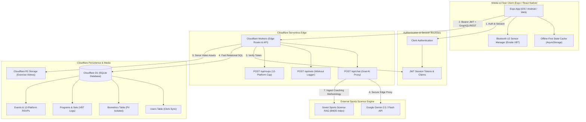
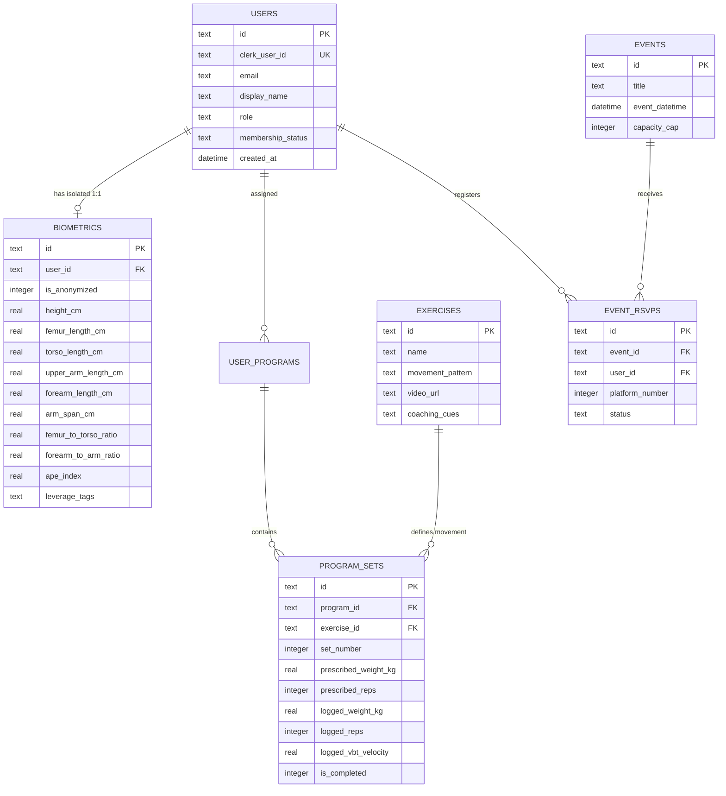
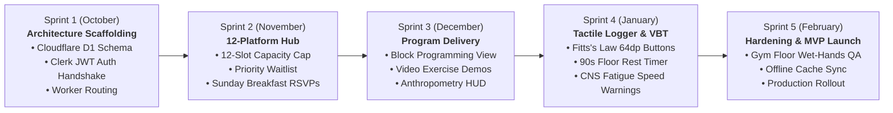

# Gym-Floor UX, React Native Mobile Architecture & February MVP Roadmap

## 1. Gym-Floor UX & Mobile Interaction Architecture

When designing a mobile interface for **Small Goods Gym**, the primary goal is replacing clunky Google Sheets spreadsheets and paper printouts with a streamlined, fast tool: athletes need to follow their 12-week programming blocks, log weights and reps in seconds, and stay focused on their training without pinching and zooming tiny spreadsheet cells.

Applying human-computer interaction (HCI) heuristics and software design guidelines ensures the app remains a transparent athletic tool rather than an administrative burden:

* **Fitts’s Law (Touch Target Optimization):** The time required to acquire a target is a function of target distance and target width. Small, cramped spreadsheet cells cause missed taps and frustration on a mobile screen.
  * *Application:* All high-frequency gym-floor actions (such as tapping *"Add Set"*, completing a set, or logging reps) utilize clear touch targets ($64\times64\text{ dp}$ on mobile) positioned within the natural sweeping thumb arc in the lower third of the screen.
* **Hick’s Law (Minimizing Cognitive Load):** Decision time increases logarithmically with the number and complexity of choices.
  * *Application:* Never present a dense spreadsheet of the entire 12-week macrocycle. Instead, display one active exercise block at a time with prominent `+` and `-` weight modifiers (`-5kg`, `-2.5kg`, `+2.5kg`, `+5kg`).
* **Doherty Threshold (Sub-400ms Feedback Loop):** Productivity and user satisfaction spike when interaction feedback occurs in under 400 milliseconds.
  * *Application:* Logging a set triggers instantaneous visual state changes (transitioning to an accent green checkmark) and micro-haptic confirmation within sub-100ms. Database synchronization occurs asynchronously in the background.
* **Postel’s Law (Robustness Principle):** *"Be conservative in what you do, be liberal in what you accept from others."*
  * *Application:* Athletes under heavy loads make logging typos (e.g. typing `"100kg"` or `"8 rpe"` into numeric fields). The input parser auto-sanitizes raw text strings into clean numbers behind the scenes without blocking modal errors.
* **Tesler’s Law (Conservation of Complexity):** Every application has an inherent amount of irreducible complexity.
  * *Application:* Shift administrative complexity away from the athlete on the platform. The app pre-populates target loads and reps based on the previous week's logs, reducing platform interactions to a single-tap confirmation unless overridden.

---

## 2. Decoupled Production Architecture: Expo, Cloudflare & Clerk

To build the client interface and Phase 2 AI microservices without disrupting Javier’s foundational authentication, roles, and user management, the architecture is decoupled into lightweight, serverless edge services:

### Architectural Principles:
1. **React Native (Expo) Client:** Chosen to unlock native iOS Bluetooth LE APIs required for wireless barbell velocity sensors (Enode / GymAware). Compiles natively for iOS/Android and deploys as a web app.
2. **Protected Variations (GRASP):** The client interacts with Javier's backend exclusively via stable Worker routes. Changes to authentication schemas or endpoints require zero changes to gym-floor UI views.
3. **Cloudflare Workers & D1 (Zero Idle Cost):** Ephemeral serverless compute eliminates expensive dedicated servers. Cloudflare D1 provides sub-millisecond SQLite queries with 3× 10GB databases included free.

---

## 3. Relational Data Model (Cloudflare D1 SQLite)

To safeguard athlete privacy under GDPR and California PII standards, personal information is strictly separated from physical biometrics.

---

## 4. February MVP Scoping & Roadmap (Pareto 80/20 Rule)

Following the Pareto Principle (80/20 Rule), 80% of gym-floor value derives from 20% of core operational features:
1. **Eliminating WhatsApp Noise:** A dedicated schedule and 12-platform RSVP hub.
2. **Replacing Spreadsheets:** Delivering workouts with inline coaching cues and tactile set logging.

### Sprint Milestones:
* **Sprint 1 (October):** Deploy D1 SQLite schema, configure Worker routes, and wire Clerk JWT validation.
* **Sprint 2 (November):** Deliver the 12-platform capacity grid and priority waitlist queue in Expo.
* **Sprint 3 (December):** Ingest coach training blocks and connect video demonstrations to exercise cards.
* **Sprint 4 (January):** Implement the big-button floor logger with real-time Enode VBT speed inputs and 90-second rest timers.
* **Sprint 5 (February):** Complete physical gym-floor trials with Joel and Holly, lock legacy Google Sheets to read-only, and launch the MVP for all 75 members.