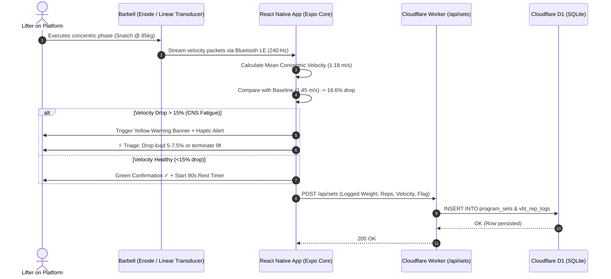
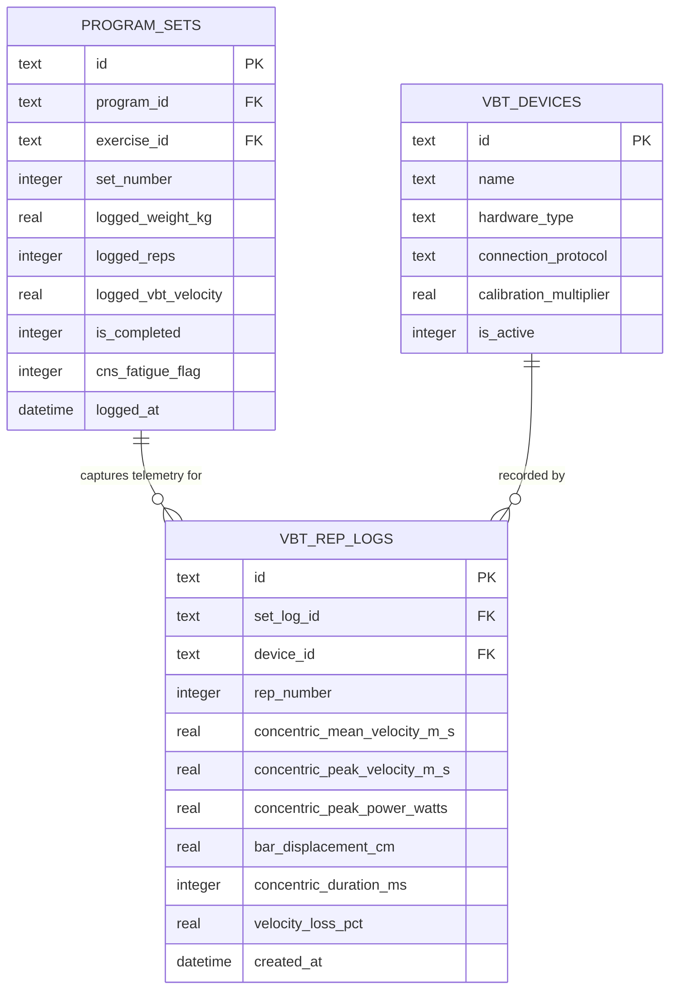

# Gym-Floor Tactile Interface & Velocity-Based Training (VBT) Architecture

## 1. Tactile Floor Interface (React Native / Expo)

Operating in gym-floor environments requires solving physical constraints: shaky hands under maximum load, sweat-covered screens, ambient noise, and central nervous system (CNS) fatigue. Standard mobile form designs fail under these conditions.

The Small Goods Gym floor client is built using **React Native (Expo)**, strictly adhering to core human-computer interaction heuristics:

* **Fitts's Law & 64dp Target Zones:**
  * Standard mobile numeric inputs are error-prone during heavy sessions.
  * The active set logger utilizes massive touch targets ($64\times64\text{ dp}$ minimum) positioned in the natural sweep of the athlete's thumb, with dedicated modifier buttons (`-5kg`, `-2.5kg`, `+2.5kg`, `+5kg`).
* **Hick's Law (Progressive Disclosure):**
  * Displaying full macrocycle spreadsheets induces cognitive overload.
  * Only the currently active set displays interactive inputs. Completed sets collapse into clean, green-accented static summaries (`Set 1: 85kg × 2 @ 1.44 m/s ✓`).
* **Doherty Threshold (<400ms Feedback Loop):**
  * Tapping *"Complete Set"* executes an optimistic UI state change with zero network lag.
  * On iOS and Android, haptic confirmation triggers via native vibration APIs (`Haptics.impactAsync()`), providing tactile confirmation over loud gym music.
* **Postel's Law (Robust Input Sanitization):**
  * Inputs strip out non-numeric characters automatically (`"85kg"` → `85.0`, `"8 rpe"` → `8.0`).

---

## 2. Real-Time Hardware Telemetry Flow (Bluetooth LE → Cloudflare D1)



---

## 3. Physiological Velocity Zones & Triage Thresholds

Grounded in the sports-science literature of **Dr. Bryan Mann** and **Vladimir Issurin**:

| Training Zone | Mean Concentric Velocity ($m/s$) | Physiological Focus | Neuromuscular Adaptation |
| :--- | :--- | :--- | :--- |
| **Absolute Strength / Max Effort** | $0.15 - 0.35\text{ m/s}$ | High intensity ($>85\%$ 1RM) | High-threshold motor unit synchronization |
| **Accelerative Strength** | $0.45 - 0.75\text{ m/s}$ | Heavy barbell acceleration | Overcoming sticking points, force recruitment |
| **Power / Explosive Strength** | $0.75 - 1.00\text{ m/s}$ | Peak wattage output | Optimal power development ($40-60\%$ 1RM) |
| **Speed-Strength** | $1.00 - 1.30\text{ m/s}$ | Velocity over mass | Rate of Force Development (RFD) |
| **Starting Strength** | $1.30 - 2.00\text{ m/s}$ | Ballistic / Plyometric | Maximal muscular contraction speed |

### The 15% Velocity Loss Cutoff:
When an athlete records a velocity drop $>15\%$ against their first working rep at the same load:
1. **Under 15% Drop:** Normal metabolic fatigue. Continue prescribed sets.
2. **15%–25% Drop:** CNS depletion. High-threshold motor units cease firing cleanly. Reduce load by $5\%–7.5\%$ for remaining sets.
3. **>30% Drop:** Excessive mechanical breakdown and acute injury risk. Immediate termination of the primary movement.

---

## 4. Relational VBT Telemetry Schema (Cloudflare D1 SQLite)

### Visual Entity-Relationship Diagram



### Executable SQLite DDL Implementation

```sql
-- Hardware Sensor Registry
CREATE TABLE IF NOT EXISTS vbt_devices (
    id TEXT PRIMARY KEY,
    name TEXT NOT NULL,                        -- e.g. 'Enode Sensor #3', 'GymAware Flex'
    hardware_type TEXT NOT NULL,               -- 'accelerometer', 'linear_position_transducer'
    connection_protocol TEXT DEFAULT 'ble',    -- 'ble' (Bluetooth Low Energy)
    calibration_multiplier REAL DEFAULT 1.0000,
    is_active INTEGER DEFAULT 1,
    created_at DATETIME DEFAULT CURRENT_TIMESTAMP
);

-- Granular Repetition-Level Telemetry
CREATE TABLE IF NOT EXISTS vbt_rep_logs (
    id TEXT PRIMARY KEY,
    set_log_id TEXT NOT NULL,
    device_id TEXT,
    rep_number INTEGER NOT NULL,
    concentric_mean_velocity_m_s REAL NOT NULL,
    concentric_peak_velocity_m_s REAL,
    concentric_peak_power_watts REAL,
    bar_displacement_cm REAL,                  -- Checks range of motion / squat depth
    concentric_duration_ms INTEGER,
    velocity_loss_pct REAL,                    -- Loss relative to fastest rep in set
    created_at DATETIME DEFAULT CURRENT_TIMESTAMP,
    FOREIGN KEY (set_log_id) REFERENCES program_sets(id) ON DELETE CASCADE,
    FOREIGN KEY (device_id) REFERENCES vbt_devices(id) ON DELETE SET NULL
);

CREATE INDEX IF NOT EXISTS idx_vbt_rep_set ON vbt_rep_logs(set_log_id);
```