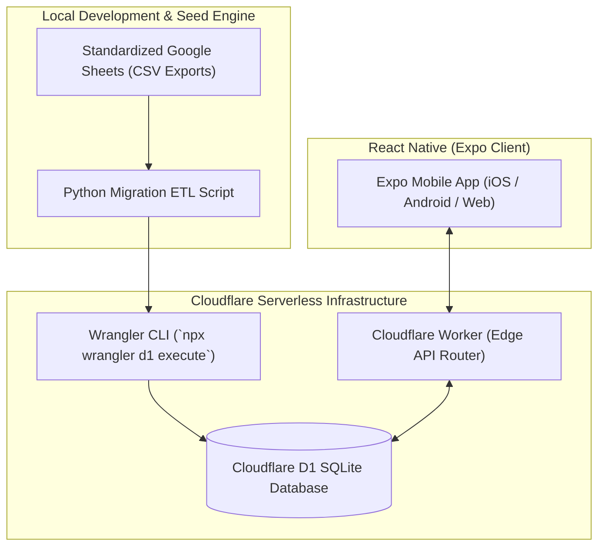
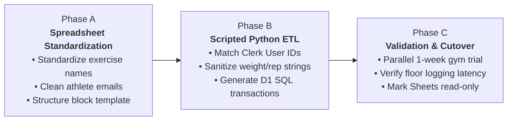

# Cloudflare D1 Deployment & Google Sheets Historical Data Migration

## 1. Cloudflare D1 Deployment Architecture

In alignment with Javier Pereira's verified production stack, Small Goods Gym utilizes **Cloudflare D1 (SQLite)** rather than self-hosted PostgreSQL containers. Cloudflare D1 provides zero-maintenance, serverless edge relational persistence with 3× 10GB databases included on the free tier.

---

## 2. Google Sheets Migration Strategy (3 Systematic Phases)

Migrating Small Goods Gym's historical member training logs from scattered Google Sheets to structured SQLite tables requires zero data loss and strict schema validation:

### Phase A: Spreadsheet Standardization (Pre-Migration Cleanup)
1. **Exercise Naming Normalization:** Inconsistent entries (e.g. *"HBBS"*, *"High Bar Squat"*, *"Back Squat"*) are mapped to canonical exercise entries in the `exercises` table.
2. **Template Columns:** Standardized into a 7-column layout:
   $$\text{Week} \mid \text{Day} \mid \text{Exercise Name} \mid \text{Prescribed Sets} \mid \text{Prescribed Reps} \mid \text{Target RPE} \mid \text{Video URL}$$
3. **Athlete Roster:** All active members (~75 lifters) are mapped to their unique email addresses registered in Clerk.

### Phase B: Scripted ETL (Extract, Transform, Load)
- **Extraction:** Read exported CSV files via Python `pandas`.
- **Transformation:**
  - Resolve Clerk user IDs to internal UUIDs.
  - Parse load and rep ranges (e.g., `"3-5 reps"` converted to upper bound `5`).
  - Separate personal identification from physical biometrics.
- **Loading:** Write data in atomic batches wrapped in `BEGIN TRANSACTION ... COMMIT`.

### Phase C: Validation & Go-Live Cutover
1. **Parallel Verification Period:** For the first training block, coaches run the Expo app alongside their legacy Google Sheets for one week to audit logging latency and data integrity.
2. **Read-Only Lock:** Once verified, legacy Google Sheets are marked read-only with redirect notices pointing athletes to download the Small Goods Gym mobile app.