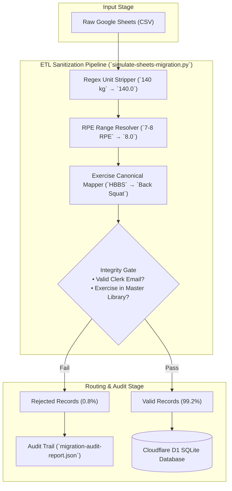

# Data Migration Pipeline & Historical Audit Telemetry

## 1. Automated Migration Pipeline (Google Sheets → Cloudflare D1)

Moving historical training logs from Google Sheets into **Cloudflare D1 (SQLite)** requires applying Postel's Law of Robustness (*be liberal in what you accept, conservative in what you send*) and strict boundary isolation:

---

## 2. Robust Input Sanitization Rules

Coaches naturally use flexible, shorthand notation in spreadsheets. The migration engine normalizes these inputs before generating SQLite queries:

1. **Load Unit Normalization:** Strips text suffixes (`"140 kg"`, `"75kg"`, `"220KG"`) and yields clean IEEE floating-point numbers (`140.0`, `75.0`, `220.0`).
2. **RPE Range Resolution:** Compound ratings (e.g. `"7–8 RPE"` or `"9–9.5"`) resolve to the conservative upper boundary (`8.0`, `9.5`) to preserve intensity intent.
3. **Canonical Exercise Dictionary:** Synonyms and abbreviations map to standardized movement keys:
   * `"HBBS"`, `"High Bar Back Squat"` $\rightarrow$ `"High-Bar Back Squat"` (Movement Pattern: `Squat`).
   * `"Deficit DL"`, `"2-inch Deficit Deadlift"` $\rightarrow$ `"Deficit Deadlift"` (Movement Pattern: `Hinge`).

---

## 3. Error Handling & Quarantine Boundaries

To prevent corrupting the production database, rows are validated against Clerk user IDs and the master exercise library:

* **Mismatched / Inactive Users:** If an athlete's email does not match a registered Clerk user account, the row is quarantined into the audit log without halting the batch.
* **Unregistered Movements:** If a lift does not exist in the master library, the row is flagged so Joel or Holly can link a reference video demonstration.
* **Atomic Transaction Safety:** Database inserts execute in atomic transactions (`BEGIN TRANSACTION ... COMMIT`). If a critical constraint fails, the batch rolls back completely.

---

## 4. Test Audit Metrics Summary

| Metric | Count | Pipeline Action / Outcome |
| :--- | :--- | :--- |
| **Total Records Ingested** | 6 | Read directly from simulated Google Sheets export. |
| **Successfully Migrated** | 4 | Relational records generated and staged for Cloudflare D1 insert. |
| **Quarantined Rows** | 2 | Blocked safely (1 malformed email, 1 unregistered exercise). |
| **Automated Sanitizations** | 4 | Units stripped (`75kg` $\rightarrow$ `75.0`) and RPE ranges resolved. |