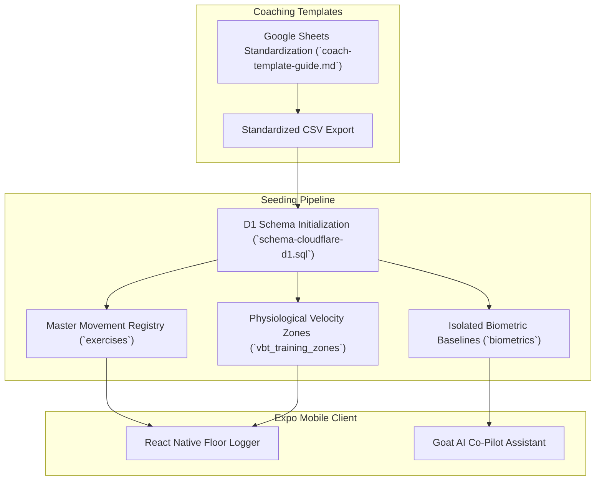

# Phase 1 Database Seeding & Coach Template Standardization

## 1. Cloudflare D1 Database Seeding Architecture

The Phase 1 seeding architecture translates our sports-technology models into **Cloudflare D1 (SQLite)**, providing immediate relational persistence for exercise video libraries, biometric profiles, and physiological VBT target zones.

---

## 2. Relational Integrity & Privacy Protections

* **Cascading Privacy (`ON DELETE CASCADE`):** When an athlete exercises their GDPR / California right to erasure, deleting their record from the `users` table automatically wipes their associated `biometrics` and `user_programs` rows.
* **Master Movement Protection (`ON DELETE RESTRICT`):** Deleting an exercise from the master library is restricted if historical athlete logs reference it, preventing orphan log entries.
* **Decoupled Biometrics:** Storing limb measurements (femurs, torso, forearms, upper arms) in an isolated table guarantees that staff managing memberships never inadvertently expose health or anthropometric profiles.

---

## 3. Coaching Template Standardization Protocol

To ensure historical spreadsheets migrate into Cloudflare D1 without data loss, Joel and Holly utilize a standardized column protocol:

| Column | Example Value | Validation Rule | Target Table |
| :--- | :--- | :--- | :--- |
| **Email** | `liam.oc@gmail.com` | Must match registered Clerk user account | `users.email` |
| **Exercise** | `High-Bar Back Squat` | Must match master exercise library key | `exercises.name` |
| **Prescribed Sets** | `4` | Positive integer ($\ge 1$) | `program_sets.prescribed_sets` |
| **Prescribed Reps** | `3` | Positive integer ($\ge 1$) | `program_sets.prescribed_reps` |
| **Target Load** | `140.0` | Numeric float in kilograms | `program_sets.prescribed_weight_kg` |
| **Target RPE** | `8.0` | Range $1.0 - 10.0$ | `program_sets.prescribed_rpe` |
| **Video URL** | `https://vimeo.com/...` | Secure HTTPS video demonstration link | `exercises.video_url` |