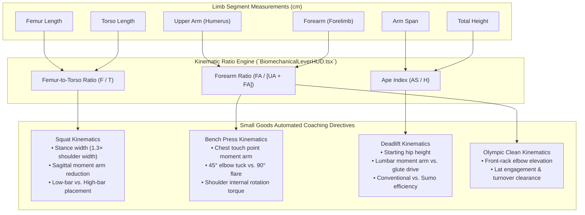

# Biomechanical Leverage HUD & Multi-Segment Kinematic Model

## 1. 4-Segment Anthropometric Diagnostic Engine

Grounded in the biomechanical research of **Dr. Dan Cleather** (*Force: The Biomechanics of Training*) and **Vladimir Zatsiorsky** (*Ergonomic Biomechanics*), the Small Goods Gym kinematics engine models human lever systems across 4 primary skeletal segments:



---

## 2. Segment Analysis & Mathematical Mechanics

### A. Femur-to-Torso Ratio (Squat Physics)
$$\text{Ratio} = \frac{\text{Femur Length (cm)}}{\text{Torso Length (cm)}}$$

* **Long Femur Lever ($\text{Ratio} > 1.0$):**
  * *Mechanical Challenge:* Long femurs force the hips further backward in the sagittal plane, extending the horizontal moment arm between the barbell and the lumbar spine ($L_{\text{spine}} = F_{\text{femur}} \times \cos(\theta)$).
  * *Coaching Cue:* Widen stance to $1.3\times$ shoulder width, flare toes outward $30^\circ$, and cue low-bar placement to recruit posterior chain musculature without excessive lumbar flexion.
* **Balanced / Short Femur Lever ($\text{Ratio} \le 0.95$):**
  * *Mechanical Advantage:* Allows an upright torso with minimal forward lean. Natural fit for Olympic high-bar and front squats.

### B. Forearm & Upper Arm Ratios (Bench Press & Clean Turnover)
$$\text{Forearm Ratio} = \frac{\text{Forearm Length (cm)}}{\text{Upper Arm} + \text{Forearm (cm)}}$$

* **Long Forearms ($\text{Ratio} > 0.47$):**
  * *Bench Press:* Extends the vertical range of motion and increases anterior shoulder capsule torque at the chest touch. Cued to tuck elbows to $45^\circ$ and maintain vertical forearms directly under the barbell.
  * *Olympic Clean:* Demands elevated lat engagement and thoracic mobility to secure the bar on the anterior deltoids without wrist crowding.

### C. Ape Index (Deadlift Mechanics)
$$\text{Ape Index} = \frac{\text{Arm Span (cm)}}{\text{Total Height (cm)}}$$

* **Positive Ape Index ($> 1.02$):**
  * *Mechanical Advantage:* Bar reaches the floor at a higher torso angle. Reduces lumbar shear stress. Conventional deadlift is mechanically superior.
* **Negative Ape Index ($< 0.98$):**
  * *Mechanical Challenge:* Lifter must hinge deeper or bend knees significantly. Cued to adopt a semi-sumo stance to shorten the torso distance to the barbell.

---

## 3. React Native Mobile Implementation (`BiomechanicalLeverHUD.tsx`)

The diagnostic engine is delivered in **React Native (Expo)**, enabling coaches on the floor to adjust sliders with instant feedback (<100ms):

```tsx
import { BiomechanicalLeverHUD } from './expo-handover/components/BiomechanicalLeverHUD';

export default function AthleteScreen({ athlete }) {
  return (
    <BiomechanicalLeverHUD
      initialMeasurements={{
        heightCm: athlete.height,
        femurCm: athlete.femur,
        torsoCm: athlete.torso,
        upperArmCm: athlete.upperArm,
        forearmCm: athlete.forearm,
        armSpanCm: athlete.armSpan,
      }}
      onSave={(measurements, analysis) => {
        // Syncs to Cloudflare D1 biometrics table
      }}
    />
  );
}
```