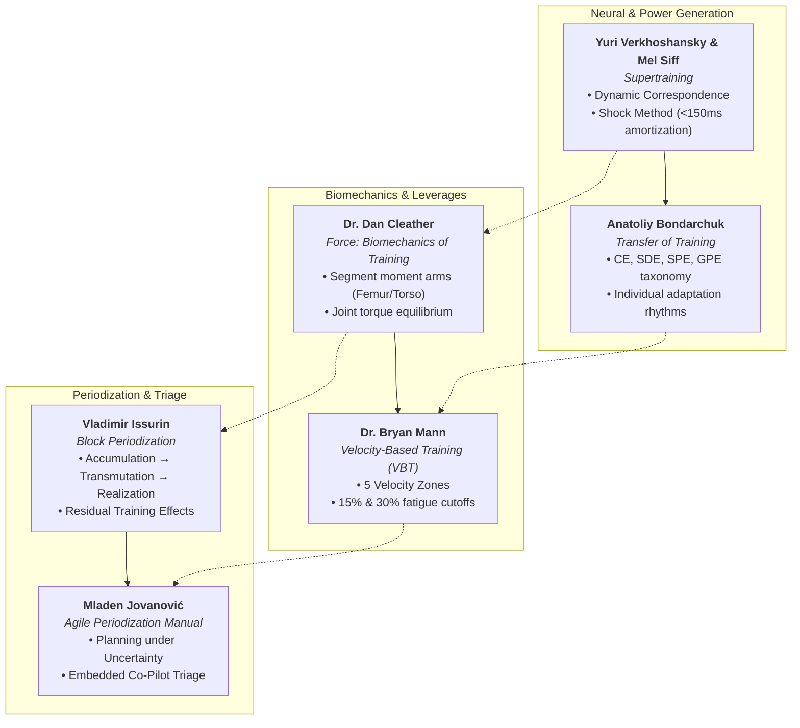

# Small Goods Gym: Advanced Sports Science, Strength Biomechanics & VBT Reference Dossier

**Target Audience:** Joel Mullen (Head Coach), Holly Hunt (Physiotherapist & Elite Lifter), Javier (Backend Architecture), Kamilla Gafurzianova (Sports Tech Architect & Olympic/Paralympic Advisor)  
**Context:** Intellectual, Biomechanical, and Algorithmic Grounding for the Small Goods Gym PWA, Goat AI Co-Pilot, and Clinical Capacity Building Architecture  
**Date:** September 15, 2026  
**Created By:** Kamilla Gafurzianova, OLY (Sports Technology Systems Architecture)

---

## Executive Summary & Theoretical Topology

Small Goods Gym rejects generic fitness app heuristics. Its platform is architected around the convergence of **Soviet Special Strength Training (SST)**, **modern Newtonian biomechanics**, and **objective sensor telemetry (Enode VBT + Activforce 2 dynamometry)**. 

To power both Joel Mullen's coaching eye, Holly Hunt's clinical rehabilitation/NDIS triage, and the automated algorithms in `athlete-profile-view.tsx` and `vbt-integration-blueprint.py`, this dossier establishes a comprehensive review of six pivotal reference works:



---

## 1. Mel Siff & Yuri Verkhoshansky: *Supertraining* (6th Expanded Edition)

### 1.1 Bibliographic Details
* **Authors:** Mel C. Siff, PhD, MSc; Yuri V. Verkhoshansky, PhD, Prof.
* **Full Title:** *Supertraining: Special Strength Training for Sporting Excellence* (6th Edition, Expanded Version)
* **Publication Date / Publisher:** 2009 (expanded re-release after Mel Siff's 2003 passing; incorporates over 100 pages of Verkhoshansky's original Russian research), Supertraining Institute (Denver, CO) / Verkhoshansky SSTM (Rome, Italy)
* **Pagination & ISBN:** 590+ pages, ISBN-10: 1874856656 / ISBN-13: 978-1874856658
* **Public Repository & Archive Identifiers:**
  * **Internet Archive Item:** [`supertrainingpap0000yuri`](https://archive.org/details/supertrainingpap0000yuri)
  * **Open Library ID:** `OL24419999M` / `OL24208226M`
  * **Digital Text Availability:** Available for digital library borrowing on Internet Archive; official print editions via Verkhoshansky.com and Ultimate Athlete Concepts.

### 1.2 Scope & Core Theoretical Framework
*Supertraining* is the international benchmark text unifying Eastern European sports science (biomechanics, physiology, motor control) with Western coaching methodologies. It synthesizes Russian, South African, and American research into a definitive technical manual.

#### Key Conceptual Pillars & Chapter Breakdown
1. **Chapter 1: Strength and the Muscular System:**
   - Muscle mechanics, microstructural force generation (cross-bridge dynamics, titin elasticity), sliding filament theory under eccentric vs. concentric loading.
   - Henneman’s Size Principle: motor unit recruitment hierarchy (Type I $\to$ Type IIa $\to$ Type IIx) and selective derecruitment in high-velocity ballistic contractions.
   - Intramuscular coordination (rate coding, motor unit synchronization) vs. intermuscular coordination (agonist-antagonist co-activation, synergist sequencing).
2. **Chapter 3 & 4: Mechanical Stress, Energy Systems & Dynamic Correspondence:**
   - **Principle of Dynamic Correspondence (*Динамическое соответствие*):** Special physical preparation exercises must strictly correspond to the competitive exercise across five non-negotiable criteria:
     1. *Amplitude and direction of movement:* Vectors of force application must mirror competitive movement coordinates.
     2. *Accentuated region of force production:* Peak force must be expressed at the specific joint angle / mechanical range where highest resistance occurs (e.g., sticking points or the 2nd pull transition).
     3. *Dynamics of the effort:* Peak force magnitude and time-to-peak force must equal or exceed competition demands.
     4. *Rate of Force Development (RFD):* The force gradient ($dF/dt$) must match the explosive speed requirement of the lift.
     5. *Regime of muscular work:* Match the specific muscle regime (isometric, concentric, eccentric, or stretch-shortening cycle [SSC]).
3. **Chapter 5: The Shock Method (*Ударный метод*):**
   - Distinction between generic American "jump training" (jumping onto boxes) and Verkhoshansky's true Shock Method (depth jumps from a wooden box, 0.50m–0.75m).
   - **The 150ms Amortization Constraint:** To utilize the stretch reflex (muscle spindles / myotatic reflex) and passive elastic recoil of tendon collagen/titin, the amortization phase (transition from eccentric deceleration to concentric propulsion) must occur in **$< 0.15\text{ s}$**. If contact exceeds $0.20\text{ s}$, mechanical strain energy dissipates as heat, rendering the drill a slow concentric jump.
   - Structural contraindications: Athletes lacking a 1.5× bodyweight squat or with patellofemoral inflammation must not perform true depth drops.
4. **Chapter 6: Long-Term Delayed Training Effect (LDTE) & Concentrated Loading:**
   - Concentrated loads temporarily suppress functional capacity ("fatigue masks fitness"); peak performance supercompensates 2–4 weeks after the volume drop during restitution.

### 1.3 Direct Coaching & Software Application to Small Goods Gym
* **AI Co-Pilot Exercise Verification:** In `exercise_library.csv`, exercises tagged as `category: Accessory` can be algorithmically evaluated against the 5 criteria of Dynamic Correspondence before being prescribed in an athlete's block.
* **Olympic Lifting & Powerlifting Fault Diagnosis:** In the Goat AI Co-Pilot, when lifters report failing lockouts or hitting a plateau, the engine enforces Verkhoshansky’s law: **"Power begins in the legs."** The bot checks whether the athlete pulled early with upper extremities or maintained floor pressure.
* **Shock Method Safety Gate:** Directly protects Holly Hunt’s clinical rehabilitation caseload: participants with low baseline isometric quadriceps force (measured via Activforce 2) are automatically locked out of high-impact reactive plyometric prescriptions.

---

## 2. Dr. Dan Cleather: *Force: The Biomechanics of Training*

### 2.1 Bibliographic Details
* **Author:** Dr. Daniel J. Cleather (Reader in Strength & Conditioning, St Mary's University Twickenham; PhD in Biomedical Engineering, Imperial College London; former coach of World and Olympic medalists).
* **Title:** *Force: The Biomechanics of Training* (Part of the Training Wisdom Collection)
* **Publication Date / Publisher:** August 31, 2021; Self-published / Training Wisdom.
* **Pagination & ISBN:** 165 pages, ISBN-13: 979-8467935775.
* **Public / Commercial Availability:** Amazon Paperback & Kindle; open-access academic papers by Dr. Cleather available on ResearchGate and St Mary's Open Research Archive covering knee joint torques, patellar kinematics, and musculoskeletal modeling.

### 2.2 Biomechanical Principles & Core Framework
Dr. Cleather strips away the pseudo-scientific terminology common in strength coaching, reconstructing training theory entirely from Newtonian mechanics:
$$\sum \vec{F} = m \vec{a} \quad \text{and} \quad \vec{\tau} = \vec{F} \times \vec{d}_{\perp}$$

#### Core Theoretical Deductions
1. **Internal vs. External Moment Arms & Joint Torques:**
   - An external force (ground reaction force [GRF] or barbell load vector) acting at a perpendicular distance ($d_{\perp}$) from a joint axis produces an *external moment* ($\tau_{ext} = F \cdot d_{\perp}$).
   - The musculoskeletal system must generate an equal and opposing *internal muscle torque* via muscular contraction acting across an internal moment arm ($d_{int}$, the distance from joint center of rotation to the tendon line of action):
   $$\tau_{muscle} = F_{tendon} \times d_{int} \ge \tau_{ext}$$
2. **Debunking "Force Absorption":**
   - The body cannot "absorb" force; force is an interaction between bodies. Athletes manage momentum change through impulse:
   $$\vec{J} = \int \vec{F} \, dt = \Delta (m\vec{v})$$
   - "Soft landings" simply increase the time of deceleration ($\Delta t$), lowering the average peak contact force applied to biological tissues.
3. **Anatomical Variations & Long Femur Squat Mechanics:**
   - Cleather provides the mathematical and geometric proof for why individuals with longer femurs relative to their torso length cannot squat with an upright trunk without falling backward:
     - To maintain balance, the combined center of mass (barbell + body) must stay vertically aligned over the midfoot base of support.
     - With a high femur-to-torso ratio ($L_{\text{femur}} / L_{\text{torso}} > 1.15$), as the knee flexes, the femur projects the pelvis substantially posterior to the foot.
     - To counterbalance this posterior pelvic displacement, the torso must tilt anteriorly (forward trunk lean).
     - This geometry dramatically increases the external moment arm at the hip ($d_{\text{hip}}$) and the lumbar spine ($L5/S1$), multiplying the hip extension torque requirement ($\tau_{\text{hip}}$) and lumbar shearing force, while reducing the external moment arm at the knee ($d_{\text{knee}}$).
   - **Cleather's Solutions for Long Femurs:**
     - *Widen stance & abduct/externally rotate hips:* Shortens the effective sagittal plane length of the femur ($L_{\text{femur}} \cdot \cos\theta$), bringing the pelvis closer to the midfoot and reducing the hip moment arm.
     - *Elevated heel / Increased ankle dorsiflexion:* Translates the tibia forward, allowing the knee to track over or past the toes, shifting the pelvis forward and preserving a more upright torso.
     - *Low-bar placement:* Moves the bar 2–3 inches lower on the posterior deltoids, shortening the spinal moment arm and improving leverage for the posterior chain.
4. **Lombard’s Paradox & Biarticular Muscle Coordination:**
   - In closed-chain multi-joint movements like the squat, both the hamstrings (hip extensor, knee flexor) and rectus femoris (hip flexor, knee extensor) contract concurrently.
   - Cleather analyzes this paradox by comparing moment arm ratios: the hamstrings have a larger internal moment arm at the hip than at the knee ($d_{\text{ham, hip}} > d_{\text{ham, knee}}$), while the quadriceps/patellar mechanism has a dominant moment arm at the knee ($d_{\text{quad, knee}} > d_{\text{rectus, hip}}$). The net result is concurrent extension at both joints.
   - At deep knee flexion ($>90^\circ$), hamstring EMG drops significantly, proving that deep squats are overwhelmingly driven by the monoarticular gluteus maximus, adductor magnus, and vasti quadriceps.

### 2.3 Direct Connection to Small Goods Gym's Architecture
* **Direct Algorithmic Bedrock:** Cleather's mathematics validate the exact calculations programmed into `athlete-profile-view.tsx` (lines 103–172) and `athlete-profile-preview.html`:
  ```typescript
  const femurToTorsoRatio = femur / torso;
  if (femurToTorsoRatio > 1.15) {
    leverageTags.push("Long Femurs");
    squatClassification = "Extreme Forward Lean / Hip-Dominant Squatter";
    squatDirective = "Recommend wider stance, moderate out-toeing (15-30°), and low-bar barbell placement to reduce shearing forces on the lumbar spine...";
  }
  ```
* **Holly Hunt’s Clinical Physio Triage:** Cleather’s patellofemoral and tibiofemoral shear analysis enables Holly to distinguish between patellar tendon irritation (caused by excessive forward knee translation / short femur mechanics) vs. lumbar spine shear / sacroiliac strain (caused by extreme forward trunk lean / long femur mechanics).

---

## 3. Essential Modern & Soviet Crossover Works

### 3.1 Vladimir Issurin: *Block Periodization* Series

#### Bibliographic Details
* **Author:** Prof. Vladimir Issurin, PhD (Wingate Institute, former Soviet Olympic rowing sports scientist).
* **Key Books:**
  1. *Block Periodization: Breakthrough in Sports Training* (2008, Ultimate Athlete Concepts, ISBN-10: 0981718000, ISBN-13: 978-0981718002, 214 pages).
  2. *Block Periodization 2: Fundamental Concepts and Training Design* (2019, Ultimate Athlete Concepts, ISBN-13: 978-0997784039).
* **Availability:** Distributed through Ultimate Athlete Concepts; key peer-reviewed review published in *Sports Medicine* (2010): *"New Horizons for the Methodology and Physiology of Training Periodization"*.

#### Core Theoretical Innovations & Comparison Matrix
Issurin systematically dissects the shortcomings of Leonid Matveyev’s traditional periodization and refines Yuri Verkhoshansky’s concentrated loading into a repeatable, sustainable system:

| Parameter | Leonid Matveyev (Classic Traditional) | Yuri Verkhoshansky (Concentrated Loading) | Vladimir Issurin (Block Periodization) |
| :--- | :--- | :--- | :--- |
| **Structure** | Linear, parallel, multi-targeted. | Unidirectional, extreme concentrated volume blocks. | Sequential, specialized mesocycle blocks. |
| **Simultaneous Qualities** | Concurrent training of strength, endurance, speed, and technique. | Single athletic quality pushed to exhaustion. | Minimal target abilities per block (usually 2, rarely 3). |
| **Interference** | High ("concurrent training effect" blunts anabolic signaling / mTOR). | Very high acute exhaustion; risk of overtraining for non-elites. | Low; eliminates negative biological interference. |
| **Peaking Frequency** | 1 to 2 peaks per year. | Unpredictable; delayed transformation takes 2–6 weeks. | Multiple peaks per year (every 6–10 weeks). |
| **Primary Mechanism** | Gradual progressive overload across months. | Long-Term Delayed Training Effect (LDTE). | Exploitation of **Residual Training Effects (RTE)**. |

#### The Three Block Archetypes
1. **Accumulation (Acc):** High volume, moderate intensity ($50-75\%$), focusing on basic motor abilities: aerobic base, basic muscular hypertrophy, technical biomechanical patterning.
2. **Transmutation (Trans):** Moderate volume, sport-specific high intensity ($75-90\%$), targeting specialized strength, strength-endurance, and movement-specific motor units under high fatigue.
3. **Realization (Real):** Low volume, maximal intensity ($90-100\%$ or high-velocity alactic work), full recovery taper, explosive power expression, and competitive peaking.

#### The Residual Training Effects (RTE) Hierarchy

| Athletic Quality | Physiological Background | Residual Duration | Small Goods Programming Implication |
| :--- | :--- | :--- | :--- |
| **Maximal Strength** | Neural recruitment, motor unit synchronization, muscle cross-sectional area (CSA) | **$30 \pm 5$ Days** | Can be maintained with minimal stimulus (1 microdose session every 10–14 days) during a power/speed block. |
| **Aerobic / Tissue Capacity** | Capillarization, mitochondrial density, glycogen stores | **$30 \pm 5$ Days** | Foundation built in Accumulation persists throughout Transmutation. |
| **Strength-Endurance** | Glycolytic enzymes, buffer capacity, local muscular endurance | **$18 \pm 4$ Days** | Must be re-stimulated every 2–3 weeks. |
| **Maximal Speed & RFD** | Neuromuscular excitability, reflex potentiation, alactic enzyme activity | **$5 \pm 3$ Days** | Highly perishable; must be scheduled immediately prior to competition or NDIS assessment. |

---

### 3.2 Dr. Bryan Mann: Velocity-Based Training (VBT) Research

#### Bibliographic Details
* **Author:** Dr. J. Bryan Mann, PhD, CSCS, SCCC (Associate Professor of Kinesiology, University of Miami; pioneer of collegiate VBT at University of Missouri).
* **Key Books & Research:**
  1. *Developing Explosive Athletes: Use of Velocity Based Training in Athletes* (3rd Edition, 2016, Ultimate Athlete Concepts, ISBN-13: 978-0997784008, 140 pages).
  2. *The Velocity-Based Training Blueprint* (2022).
  3. Key Peer-Reviewed Works: Mann et al. (2015), *"Velocity-Based Training: A New Direction for Strength and Conditioning"*, *Strength and Conditioning Journal*.

#### Core Contributions: The 5-Zone Velocity Framework

| Zone | Training Quality | Velocity Range (m/s) | Approx. % 1RM | Adaptation Mechanism |
| :---: | :--- | :---: | :---: | :--- |
| **1** | **Absolute Strength** | $< 0.50\text{ m/s}$ | $85\% - 100\%$ | Maximum motor unit recruitment, inter/intramuscular coordination. |
| **2** | **Accelerative Strength** | $0.50 - 0.75\text{ m/s}$ | $70\% - 85\%$ | Moving heavy loads with maximal intent; force-velocity sweet spot. |
| **3** | **Strength-Speed** | $0.75 - 1.00\text{ m/s}$ | $50\% - 70\%$ | Moving moderate loads at high velocity; peak power output. |
| **4** | **Speed-Strength** | $1.00 - 1.30\text{ m/s}$ | $30\% - 50\%$ | Velocity prioritized over load; explosive rate of force development. |
| **5** | **Starting Strength** | $> 1.30\text{ m/s}$ | $< 30\%$ | Overcoming inertia from a dead stop; purely ballistic expression. |

#### Minimum Velocity Thresholds (MVT) & Fatigue Cutoffs
* **MVT Limits:** Back Squat $\sim 0.30\text{ m/s}$; Bench Press $\sim 0.15 - 0.18\text{ m/s}$; Deadlift $\sim 0.15\text{ m/s}$.
* **$10\% - 20\%$ Velocity Loss:** Ideal for athletic power, sprinting speed, and clean neural adaptations ($< 24\text{ hours}$ recovery).
* **$20\% - 30\%$ Velocity Loss:** Ideal for functional hypertrophy and strength-endurance ($24 - 48\text{ hour}$ recovery).
* **$> 30\%$ Velocity Loss:** Severe neuromuscular fatigue, massive metabolic accumulation, acute breakdown in bar trajectory ($48 - 72\text{ hours}$ recovery).

---

### 3.3 Mladen Jovanović: Contemporary Periodization & Agile S&C Frameworks

#### Bibliographic Details
* **Author:** Mladen Jovanović (Sports Performance Scientist, Founder of *Complementary Training*, former Head of Physical Preparation for elite European soccer and track clubs).
* **Key Books:**
  1. *Strength Training Manual: The Agile Periodization Approach* (Volume One & Two) (2020, Complementary Training, ISBN-13: 978-8690080309, 620+ pages).
  2. *Agile Periodization: A Systematic Approach to Decision Making under Uncertainty* (2023).

#### Core Concepts & Agile S&C Philosophy
1. **Agile Iterative Cycles:** Replaces rigid 12-week predictive programming with 1–3 week sprint iterations.
2. **Minimum Viable Program (MVP):** Determining the lowest training dose necessary to stimulate adaptation.
3. **Dual-Loop Auto-Regulation:** Combines subjective athlete monitoring (RPE, sRPE) with objective physics (VBT bar velocity, isometric peak force).

---

### 3.4 Dr. Anatoliy Bondarchuk: *Transfer of Training in Sports* (Volumes I–III)

#### Bibliographic Details
* **Author:** Dr. Anatoliy P. Bondarchuk (Olympic Gold Medalist in Hammer Throw; Coach of World Record holders Yuriy Sedykh and Sergey Litvinov). Translated by Dr. Michael Yessis.
* **Key Series:** *Transfer of Training in Sports* (Volumes I–III, Ultimate Athlete Concepts, 2007–2010).

#### Core Theoretical Framework
1. **The 4-Tier Exercise Classification Taxonomy:**
   - **Competitive Exercises (CE):** Identical to competition movements.
   - **Special Developmental Exercises (SDE):** Duplicates parts of the competitive movement with identical neuromuscular pathways. Highest transfer.
   - **Special Preparatory Exercises (SPE):** Exercises involving the same muscular systems without duplicating the exact movement trajectory.
   - **General Preparatory Exercises (GPE):** Exercises developing overall physical work capacity. Transfer approaches zero for elite lifters.
2. **Individual Adaptation Rhythms:**
   - *Fast Adaptors (Type I):* Reach peak form in 2–3 weeks; require frequent exercise rotation.
   - *Moderate Adaptors (Type II):* Reach peak form in 4–6 weeks.
   - *Slow Adaptors (Type III):* Require 7–10 weeks of progressive loading to provoke deep structural adaptation.

---

## 4. Master Comparative Reference Matrix

| Author & Core Work | Primary Paradigm | Core Mathematical / Biomechanical Metric | Software / Code Hook in Small Goods | Hardware Hook | Access & Ingestion Pathway |
| :--- | :--- | :--- | :--- | :--- | :--- |
| **Mel Siff & Yuri Verkhoshansky**<br>*Supertraining* (6th Exp. Ed.) | Dynamic Correspondence & Shock Method | Amortization time $< 150\text{ ms}$; $dF/dt$ (RFD); 5 correspondence criteria | Movement standard verification in `exercise_library.csv` | Activforce 2 (Isometric RFD) & Force Plates | Internet Archive (`supertrainingpap0000yuri`), Open Library, Verkhoshansky.com |
| **Dr. Dan Cleather**<br>*Force: Biomechanics of Training* | Newtonian Joint Torque Equilibrium | $\tau = F \cdot d_{\perp}$; Moment arm ratio ($d_{\text{hip}} / d_{\text{knee}}$) | `athlete-profile-view.tsx` (Femur/Torso $>1.15$ heuristics) | 2D Computer Vision (Plate 450mm scale) | Amazon (ISBN: 979-8467935775), ResearchGate papers |
| **Vladimir Issurin**<br>*Block Periodization* Series | Residual Training Effects (RTE) | RTE decay timelines (Max strength: 30d; Speed: 5d) | Mesocycle progression in `athlete_training_logs.csv` | Calendar / Training Block Scheduler | Ultimate Athlete Concepts (ISBN: 978-0981718002) |
| **Dr. Bryan Mann**<br>*Velocity-Based Training* | 5-Zone MCV & Velocity Loss Fatigue | Mean Concentric Velocity ($m/s$); $20\%$ & $30\%$ velocity decay | `vbt-integration-blueprint.py` (Lines 87–98) | **Enode Accelerometer** & Linear Transducers | Ultimate Athlete Concepts (ISBN: 978-0997784008) |
| **Mladen Jovanović**<br>*Strength Training Manual* | Agile Periodization under Uncertainty | Minimum Viable Program (MVP); dual-loop RPE + VBT auto-regulation | `workout-logger-prototype.tsx` (Fitts/Hick UI heuristics) | Real-time In-app Timers & RPE Sliders | Complementary Training (ISBN: 978-8690080309) |
| **Anatoliy Bondarchuk**<br>*Transfer of Training* (Vols I–III) | 4-Tier Exercise Taxonomy (CE, SDE, SPE, GPE) | Transfer Index ($T$); Adaptation rhythms (Fast vs Slow) | Exercise classification schema & accessory rotation | 1RM Tracking & Activforce 2 Dynamometer | Ultimate Athlete Concepts (ISBN: 978-0981718019) |
