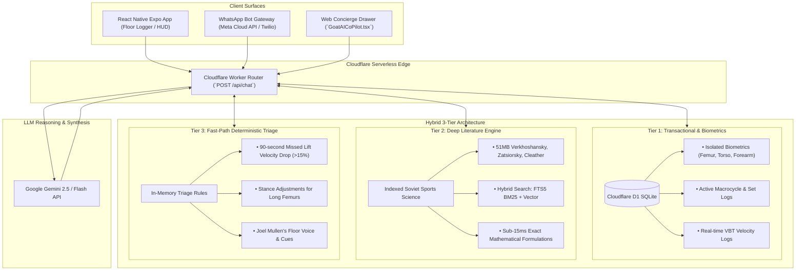

# Small Goods Gym — Knowledge Base Architecture & Vector Database Evaluation

**Target Systems:** Small Goods Core Platform, Javier's Cloudflare Workers & D1 (SQLite) backend, Edge AI Gateway
**Target Audience:** Kamilla Gafurzianova, Joel Mullen, Javier  
**Date:** September 15, 2026  
**Created By:** Antigravity (Sports Tech Architecture Team)

---

## 1. Executive Summary & Strategic Decision Matrix

The Small Goods Gym AI Co-Pilot ("Goat AI") faces a dual operational challenge:
1. **Gym-Floor Real-Time Operational Triage (Sub-400ms, Deterministic):** Athletes resting 90 seconds between heavy working sets, missing snatches or experiencing acute velocity drop-offs ($\Delta v > 15\%$), needing instant corrective cues based on their anthropometry (e.g., `#LongFemurs`, `#ShortTorso`) without LLM hallucination or latency.
2. **Deep Macro Sports Science Consulting (1.5s–3s, Generative RAG):** Coaches and athletes querying complex periodization planning, concentrated volume blocks (LDTE), dynamic correspondence criteria, VBT force-velocity profiles, or NDIS clinical exercise justifications drawn from **~51 MB of dense Soviet sports science literature (Verkhoshansky, Zatsiorsky, Chernyak, Bondarchuk)** and gym meeting dossiers.

### The Architectural Decision Matrix

| Evaluation Dimension | Option 1: Firestore + Firestore Vector Search | Option 2: Embedded / Local Vector DB (LanceDB) | Option 3: Cloud Managed RAG (Vertex AI Search / Pinecone) | Option 4: Pure In-Context RAG (Gemini 1.5/2.0 Large Window) | Option 5: Hybrid 3-Tier Architecture (**RECOMMENDED**) |
| :--- | :--- | :--- | :--- | :--- | :--- |
| **Primary Data Role** | NoSQL transactional + basic vector KNN | Zero-cost embedded vector retrieval | Enterprise document search & OCR | Massive unstructured context ingestion | Best-of-breed separation of concerns |
| **Floor Triage Latency** | 250ms – 600ms (cloud round-trip) | **< 15ms** (in-process IPC/disk) | 350ms – 800ms (cloud API) | 2,500ms – 7,000ms (massive prompt) | **< 5ms** (local fast-path) / **~800ms** (Flash) |
| **Literature Retrieval Quality** | Moderate (basic Cosine/KNN, no BM25 hybrid) | **High** (Native Hybrid: BM25 + Vector) | High (managed re-ranking & chunking) | Very High (attention across whole text) | **Elite** (Hybrid BM25/Vector + Golden Cues) |
| **Handling of Soviet Math & Tables** | Poor (requires external parsing) | High (custom Markdown/LaTeX parser) | Moderate to High (Cloud Document AI) | High (multimodal PDF tokens) | **Highest** (Marker OCR + LanceDB) |
| **Monthly Operating Cost** | Low–Moderate ($0.05–$0.15 / 10k reads) | **$0.00** (runs in bot engine process) | High ($70–$300/mo base cluster fees) | Very High ($350–$600/mo context cache) | **Ultra-Low (< $5–$15/mo total)** |
| **Operational & DevOps Complexity** | Low (if already on Firebase) | **Ultra-Low** (single pip/npm package) | High (VPC, indexing pipelines, IAM) | Low (prompt engineering only) | **Low–Moderate** (clean modular separation) |
| **Offline / Edge Capability** | None (requires live internet) | **Full local capability** | None | None | **Local triage offline, Cloud RAG online** |

---

## 2. Comparative Evaluation of the Architectural Options

### Option 1: Firebase Firestore as Primary Store (Collections + Vector Search)
* **Mechanism:** Documents stored in collections (`athletes`, `sessions`, `exercises`, `literature_chunks`). Firestore Vector Search uses vector embeddings generated externally (via Vertex AI `text-embedding-004`) and performs KNN/Euclidean searches with single-field pre-filters.
* **Pros:** Single console, real-time client listeners (`onSnapshot`), native Firebase auth integration.
* **Cons:**
  * **No native embedding pipeline:** Firestore does not vectorize text on write; requires Cloud Functions orchestration.
  * **Billing penalty at scale:** Firestore bills vector searches as **1 document read per 100 vector index entries scanned**, which rapidly accelerates costs during frequent gym-floor queries.
  * **Query limitations:** Cannot execute native BM25 full-text keyword boosting alongside vector distance. Finding specific Soviet metrics (e.g., `"КПШ"` or `"0.15s amortization"`) often fails on pure semantic cosine distance.

### Option 2: Embedded / Local Vector DB (LanceDB / SQLite-vec / Chroma)
* **Mechanism:** An in-process, zero-server database running inside the Node.js or Python `concierge-bot-engine`. **LanceDB** stores embeddings in disk-based Apache Arrow format (`.lance` files) with native IVF-PQ indexing and built-in Tantivy full-text search.
* **Pros:**
  * **Zero cloud infrastructure costs:** Zero monthly cluster fees, zero managed database bills.
  * **Sub-15ms local query speed:** Operates directly over shared memory / local NVMe disk via Arrow.
  * **Native Hybrid Search (BM25 + Vector):** Combines keyword searching with semantic vectors, essential for finding exact formulas ($dF/dt$) and Soviet abbreviations.
  * **File-based portability:** The entire sports science library (~10 books, ~1,500 chunks) compiles into a compact ~45MB LanceDB directory that commits directly into Docker containers or syncs via Cloud Storage buckets.
* **Cons:** Not suitable as a multi-user transactional store for concurrent user logins.

### Option 3: Cloud Managed Vector DB / Managed RAG (Pinecone, Vertex AI Search)
* **Mechanism:** Fully managed enterprise vector storage with automated document ingest, chunking, OCR, and re-ranking.
* **Pros:** Managed OCR, scales to millions of documents.
* **Cons:**
  * **Severe cost overkill for a boutique gym:** A ~51MB static corpus (10 books + transcripts) does not justify a $70–$250/month Pinecone or Vertex AI Search minimum pod spend.
  * **Loss of chunking control:** Managed OCR engines frequently mangle complex Soviet multi-column periodization matrices (Chernyak) and mathematical sub-equations.

### Option 4: Large Context Window / Direct In-Context RAG (Gemini 1.5 / 2.0 Flash)
* **Mechanism:** Leveraging Gemini's 1M-2M token context window by passing raw PDFs directly or utilizing Gemini Context Caching.
* **Pros:** Zero indexing infrastructure; global document reasoning across all books simultaneously.
* **Cons:**
  * **Severe Latency:** Processing 500k–1M tokens incurs **3 to 10 seconds of Time-To-First-Token (TTFT)**.
  * **Prohibitive Context Caching Cost:**
    * 10 books (~3,000 scanned pages) $\approx 750,000$ multimodal tokens.
    * Gemini Context Caching storage fee: $\approx \$0.75/\text{hour} = \mathbf{\$18.00/\text{day}} \approx \mathbf{\$540/\text{month}}$ just to maintain the cache!
  * Scanned Russian books from the 1970s contain scan artifacts that burn excessive vision tokens and cause attention degradation.

---

## 3. The Recommended Pattern: Hybrid 3-Tier Architecture



### Breakdown of the 3 Tiers

#### Tier 1: Transactional & Biomechanical State (Cloudflare D1 SQLite)
* Athlete biometric data: `height_cm`, `femur_length_cm`, `torso_length_cm`, `upper_arm_length_cm`, `forearm_length_cm`, `arm_span_cm`, `ape_index`.
* Dynamic tags: `#LongFemurs`, `#ShortTorso`, `#LongForearms`, `#HipImpingement`.
* Real-time session telemetry: `set_number`, `logged_weight_kg`, `logged_vbt_velocity`, $\Delta v$ decay.
* Active program state: 12-week macrocycle, current 4-week block (Accumulation / Transmutation / Realization).
* **Storage Choice:** Aligns with Javier’s production SQLite D1 database (`schema-cloudflare-d1.sql`).


#### Tier 2: Deep Literature Library (Embedded LanceDB)
* Pre-processed, OCR-cleaned, and semantically chunked Soviet sports science books (Verkhoshansky, Zatsiorsky, Chernyak, Bondarchuk, Cleather).
* VBT technical dossier, computer vision calibration formulas (WL Analysis 450mm plate scaling, My Jump flight time physics).
* Joel Mullen intake transcripts, gym FAQ, and Holly Hunt NDIS clinical documentation.
* **Engine:** **LanceDB** embedded directly inside `concierge-bot-engine`. It runs hybrid search (Vector + BM25 keyword matching) using Google's `text-embedding-004` (768 dimensions).
* **Execution:** Retrieves top 3–5 exact text chunks and formulas in **< 12ms**, injecting them into the synthesis prompt.

#### Tier 3: Curated Prompt-Layer Golden Rules & Fast-Path Triage
* In-memory deterministic decision trees (< 5ms execution time, zero LLM API call).
* Joel Mullen's coaching cues ("From Goat: Push knees out, drive the floor").
* Strict safety boundaries: Red-flag injury rules, medical disclaimers, NDIS clinical compliance rules for Holly.
* Small Goods Gym brand voice, typography bindings (`\u00A0` non-breaking spaces, Zero Em-Dash standard).

---

## 4. Specialized Technical Considerations

### 1. Chunking Strategy for Dense Sports Science Texts
* **Conversion:** Run **Marker** or Gemini 2.0 multimodal document extraction to convert scanned Cyrillic/English PDFs into GitHub Flavored Markdown (GFM) with LaTeX formulas.
* **Atomic Protection:** Equations and preceding definitions ($dF/dt$, $\tau = F \cdot d_\perp$) must never be split across chunks. Chernyak's volume matrices and Zatsiorsky's loading zones are indexed as whole tables with a prepended natural language summary.
* **Header Breadcrumb Injection:** Each chunk is prepended with contextual metadata:
  ```markdown
  [SOURCE: Verkhoshansky - Programming and Organization of Training (1985)]
  [CHAPTER: 3. Principles of Special Strength Training]
  [TOPIC: The Shock Method & Amortization Phase Dynamics]
  [APPLICABLE LIFTS: Depth Jumps, Snatch Turnover, Drop Jumps]
  ```
* **Chunk Parameters:** 400–600 tokens with 80-token overlap snapped to sentence boundaries.

### 2. Multilingual Reconciliation (Russian Originals vs. English Translations)
* Use **Google Vertex AI `text-embedding-004`**, which maps Russian and English into the same geometric vector space. An English query (*"What is the maximum ground contact time before elastic energy dissipates in depth jumps?"*) directly retrieves Verkhoshansky's Russian text (*"время амортизации... не должно превышать 0,12–0,15 с"*) alongside Yessis's English translation.
* Maintain a bilingual metadata index for key terms: *Динамическое соответствие* (Dynamic Correspondence), *Ударный метод* (Shock Method), *КПШ* (Number of Lifts), *ОТЭ* (Long-Term Delayed Training Effect).

### 3. Monthly Cost Comparison (~100 lifters, 15,000 queries/month)

| Component | Pure Gemini Context Caching | Managed Vertex AI Search + Cloud SQL | Recommended Hybrid (Tier 1-3: LanceDB + Flash) |
| :--- | :--- | :--- | :--- |
| **Database Storage / Hosting** | $0.00 | $55.00/mo (Cloud SQL) | $0.00 (LanceDB embedded) / $0 (Postgres on Javier server) |
| **Vector DB / Search Index** | $0.00 | $120.00/mo (Managed Vertex Search) | **$0.00** (Local disk / Arrow) |
| **Context Caching / Embedding Storage** | **$540.00/mo** (750k tokens cached 24/7) | $15.00/mo (Embeddings) | **$0.08** (One-time embedding generation) |
| **LLM Inference Calls** | $45.00/mo (Gemini Flash input/output) | $45.00/mo | **$12.00/mo** (Only relevant chunks injected) |
| **Total Monthly Cost** | **~$585.00 / month** | **~$235.00 / month** | **~$12.00 – $15.00 / month** |

The Hybrid architecture saves **> 95% of operational infrastructure costs** while delivering sub-second gym-floor response times.

---

## 5. Integration Blueprint for `concierge-bot-engine`

```text
concierge-bot-engine/
├── data\
│   └── sports_science.lance\          # Embedded LanceDB hybrid index (< 50MB)
├── profiles\
│   └── small_goods_gym.json           # Brand voice, color tokens (#1A1A1A, #22C55E), system prompt
├── core\
│   ├── knowledge_store.py             # LanceDB hybrid search (BM25 + text-embedding-004)
│   └── llm_concierge.py               # Deterministic fast-path triage (< 5ms) + Gemini Flash streaming
└── tools\
    └── ingest_sports_science.py       # PDF-to-Markdown + atomic chunker + vectorizer script
```
