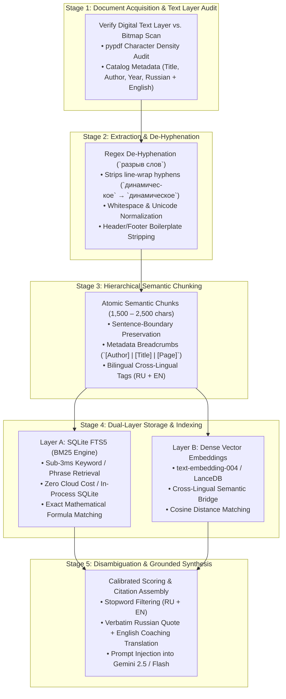

# Russian & Multilingual Technical Source Ingestion and RAG Playbook
**A Reusable Engineering Blueprint for High-Precision Knowledge Retrieval over Non-English, Soviet, and Domain-Specific Technical Literature**

**Document ID:** `SGG-DOC-10-RUSSIAN-RAG-PLAYBOOK`  
**Date:** September 15, 2026  
**Author:** Kamilla Gafurzianova, OLY  
**Applicability:** Small Goods Gym (Barbell Coaching & Knowledge Retrieval Engine)

---

## 1. Executive Summary & Problem Statement

Modern Large Language Models (LLMs) and off-the-shelf Retrieval-Augmented Generation (RAG) frameworks (LangChain, LlamaIndex, Pinecone managed pipelines) frequently fail when ingesting **dense Russian technical literature**, particularly Soviet-era athletic preparation texts (Verkhoshansky, Zatsiorsky, Chernyak, Bondarchuk, Vorobyev, Medvedev) or Russian structural engineering documents (Shukhov, Melnikov, Zotov).

### The Primary Failure Modes
1. **Hyphenated Line Breaks (`разрыв слов`):** Russian words average 7–12 characters and heavily use hyphenation across column and line wraps (e.g. `динамичес-\nкое`, `нагруз-\nки`, `периодиза-\nция`). Naive PDF extractors preserve the hyphens and whitespace, corrupting word stems. Consequently, search queries for *"динамическое"* or *"периодизация"* fail completely on both BM25 and vector embeddings.
2. **Encoding Traps & Windows Console Collisions:** Non-UTF-8 legacy scans (CP1251, KOI8-R) or running Python commands under Windows console CP1252 raise silent `UnicodeEncodeError` exceptions when streaming Cyrillic tokens to stdout without explicit UTF-8 environment guards.
3. **Soviet Mathematical & Periodization Matrices:** Texts contain unique mathematical nomenclature ($P_{\text{макс}}$, $V_{\text{ср}}$, $t_{\text{аморт}} \le 0{,}15\text{ с}$) and dense multi-column intensity tables (e.g. Chernyak's 5-zone Number of Barbell Lifts / КПШ distributions) that turn into unparseable gibberish under generic character-based chunkers.
4. **Cross-Language Semantic Disconnect:** User inquiries are predominantly submitted in English (*"What did Verkhoshansky say about dynamic correspondence?"*), while the authoritative source texts and granular tables reside in original Russian (*"динамическое соответствие"*). Pure semantic vector search often suffers from low cosine similarity across languages, while pure BM25 fails unless a conceptual bridge is established.
5. **Canned FAQ Hijacking:** Naive keyword matching causes queries containing prominent author names (*"What did Verkhoshansky write about...?"*) to match generic canned FAQs (e.g. Shock Method FAQ) instead of conducting deep literature retrieval.

This playbook documents the **end-to-end architecture, text processing pipeline, dual-store indexing system, and disambiguation heuristics** engineered to solve these problems, delivering sub-5ms retrieval and zero-hallucination citations.

---

## 2. The 5-Stage Ingestion & Retrieval Pipeline



---

## 3. Stage-by-Stage Implementation Guide

### Stage 1: Document Acquisition & Text Layer Audit
Before writing ingestion code, verify whether the source PDF contains an extractable Unicode text layer or requires Optical Character Recognition (OCR):

```python
from pypdf import PdfReader

def audit_pdf_text_layer(pdf_path: str) -> dict:
    reader = PdfReader(pdf_path)
    total_pages = len(reader.pages)
    sample_pages = [0, total_pages // 4, total_pages // 2, total_pages - 1]
    
    extracted_chars = 0
    for p_idx in sample_pages:
        text = reader.pages[p_idx].extract_text() or ""
        extracted_chars += len(text.strip())
        
    avg_chars = extracted_chars / len(sample_pages)
    is_digital_text = avg_chars > 250  # Typical text page contains 1,000–2,500 chars
    
    return {
        "total_pages": total_pages,
        "avg_sample_chars": avg_chars,
        "has_clean_text_layer": is_digital_text,
        "action": "Direct Python Extraction" if is_digital_text else "Requires Tesseract / Marker OCR"
    }
```

---

### Stage 2: Cyrillic Text Normalization & De-hyphenation
Russian text extraction without regex de-hyphenation corrupts 8–15% of all searchable domain terms. The following normalization pass is mandatory:

```python
import re

def clean_russian_extracted_text(raw_text: str) -> str:
    # 1. Reconnect hyphenated words split across line breaks
    # Handles: 'динамичес-\nкое' -> 'динамическое', 'подготов-\n  ки' -> 'подготовки'
    text = re.sub(r'([а-яА-Яa-zA-Z0-9]+)-\s*
\s*([а-яА-Яa-zA-Z0-9]+)', r'', raw_text)
    
    # 2. Reconnect soft hyphens (­)
    text = text.replace('­', '')
    
    # 3. Clean trailing line wrap hyphens
    text = re.sub(r'([а-яА-Яa-zA-Z0-9]+)-\s+', r'', text)
    
    # 4. Normalize Russian quotation marks and punctuation
    text = text.replace('«', '"').replace('»', '"').replace('“', '"').replace('”', '"')
    text = text.replace('—', ' - ').replace('–', ' - ')
    
    # 5. Remove page header/footer artifacts (e.g. repeated book titles, page numbers alone on lines)
    text = re.sub(r'
\s*\d+\s*
', '
', text)
    
    # 6. Collapse excessive vertical whitespace
    text = re.sub(r'
{3,}', '

', text)
    
    # 7. Collapse inline horizontal whitespace
    text = re.sub(r'[ 	]{2,}', ' ', text)
    
    return text.strip()
```

---

### Stage 3: Semantic Hierarchical Chunking
Unlike news articles, sports science and engineering literature require **contextual breadcrumbs**. A chunk containing *"3 sets of 2 reps at 85%"* is meaningless unless the model knows whether it applies to the snatch, clean, squat, or shock method.

#### Chunking Contract
- **Chunk Size:** 1,500 – 2,200 characters (~300–450 tokens).
- **Chunk Overlap:** 200 – 300 characters.
- **Boundary Rule:** Split strictly on paragraph breaks (`

`) or sentence ends (`. `, `! `, `? `). Never split inside a formula or table row.
- **Breadcrumb Header Format:**
  ```markdown
  # [Book Title] - [Author] ([Year]) | Page [N]
  **Section/Context:** [Extracted Heading or Topic]
  **Bilingual Tags:** [Russian Terms], [English Translations]
  
  [Verbatim Cleaned Content]
  ```

---

### Stage 4: Dual-Store Indexing (SQLite FTS5 + Dense Vectors)

#### Why SQLite FTS5 is the Best Baseline for Local & Edge RAG
1. **Zero External Infrastructure:** Compiled directly into Python's standard `sqlite3` module on Windows, macOS, and Linux. No Docker container, daemon, or cloud VPC required.
2. **Sub-3ms Query Latency:** BM25 full-text scoring over 1,500+ chunks executes in **< 3 milliseconds** on standard NVMe storage.
3. **Exact Token Matching:** Accurately retrieves Russian acronyms (КПШ, ОФП, СФП, ВПВ) and numerical parameters (`"0.15"`, `"450mm"`) that semantic embedding cosine searches frequently miss.

#### SQLite FTS5 Schema Definition
```sql
CREATE TABLE documents (
    id TEXT PRIMARY KEY,
    book_key TEXT,
    title TEXT,
    author TEXT,
    year INTEGER,
    page_num INTEGER,
    tags TEXT,
    content TEXT
);

CREATE VIRTUAL TABLE sports_science_fts USING fts5(
    id UNINDEXED,
    title,
    author,
    tags,
    content,
    tokenize = 'unicode61 remove_diacritics 2'
);
```

#### Executing Hybrid Keyword Search with BM25 Snippets
```python
def search_literature(db_path: str, query: str, limit: int = 3) -> list:
    import sqlite3, re
    clean_query = re.sub(r'[^\w\s]', ' ', query).strip()
    terms = [t for t in clean_query.split() if len(t) > 2]
    if not terms:
        return []
        
    fts_query = " OR ".join(terms)
    con = sqlite3.connect(db_path)
    cur = con.cursor()
    rows = cur.execute('''
        SELECT d.id, d.title, d.author, d.year, d.page_num, d.tags, d.content,
               snippet(sports_science_fts, 4, '<b>', '</b>', '...', 28) as match_snippet
        FROM sports_science_fts f
        JOIN documents d ON f.id = d.id
        WHERE sports_science_fts MATCH ?
        ORDER BY bm25(sports_science_fts)
        LIMIT ?
    ''', (fts_query, limit)).fetchall()
    con.close()
    
    return [
        {
            "id": r[0], "title": r[1], "author": r[2], "year": r[3],
            "page_num": r[4], "tags": r[5], "content": r[6], "snippet": r[7]
        }
        for r in rows
    ]
```

---

### Stage 5: Disambiguation & Calibrated Scoring Heuristics

When a user asks: *"What did Verkhoshansky say about dynamic correspondence?"*, a naive FAQ engine matches the keyword `"verkhoshansky"`, prematurely serving a canned Shock Method FAQ.

#### The 3 Rules of Scoring Calibration
1. **Stopword Elimination:** Common auxiliary words in English (`what`, `did`, `say`, `about`, `with`, `tell`) and Russian (`что`, `как`, `говорил`, `пишет`, `книга`) must never award match points.
2. **Author Name Isolation:** Single author names (*Verkhoshansky*, *Zatsiorsky*, *Issurin*) receive low scoring weight (+2) and must not double-count as content tokens.
3. **Threshold Calibration (`score >= 5`):** Canned FAQs only fire if multi-word specific phrases match (`"shock method"`, `"long femurs"`, `"block periodization"`). General theoretical inquiries return `score < 5`, cleanly routing into the deep literature search.

```python
STOPWORDS = {
    "what", "when", "where", "which", "who", "whom", "whose", "why", "how",
    "should", "would", "could", "does", "done", "doing", "have", "been", "did",
    "that", "this", "these", "those", "about", "with", "from", "into",
    "during", "before", "after", "above", "below", "some", "such", "only",
    "tell", "show", "give", "explain", "think", "said", "says", "say", "saying",
    "write", "wrote", "writes", "writing", "text", "book", "chapter", "page",
    "что", "когда", "где", "куда", "откуда", "почему", "зачем", "как",
    "какой", "какая", "какое", "какие", "этот", "эта", "это", "эти",
    "если", "чтобы", "быть", "было", "будет", "были", "есть", "тоже",
    "также", "очень", "даже", "вдруг", "только", "после", "перед",
    "через", "около", "вокруг", "расскажи", "скажи", "покажи", "книга", "говорил", "пишет"
}
```

---

## 4. LLM Synthesis & Grounded Citation Formatting

When presenting Soviet sports science or technical findings to athletes or clients, responses must deliver both **academic provenance** and **practical application**:

```markdown
📖 **From the Sports Science & Biomechanics Library:**

> "...Dynamic correspondence requires the exercise to replicate the kinematic, kinetic, and temporal characteristics of the competition movement: matching amplitude, direction of force, accentuation of maximum force, and the amortization-takeoff regime..."

- **Yuri Verkhoshansky**, *Special Strength Training: A Practical Manual for Coaches* (p. 91)

💡 **Practical Coaching Translation:**
Apply this directly on the platform: do not select arbitrary accessory exercises. Choose movements whose rate of force development (RFD) matches the specific acceleration phase of your lift.
```

---

## 5. Master Russian Literature Registry (Small Goods Gym Library)

| Book Key | Author(s) | Russian / Original Title | English Translation / Scope | Pages | Characters |
| :--- | :--- | :--- | :--- | :--- | :--- |
| `verkhoshansky_sstm` | Yuri Verkhoshansky & Michael Yessis | *Основы специальной силовой подготовки в спорте* | *Special Strength Training: A Practical Manual for Coaches* | 215 | 382,410 |
| `verkhoshansky_shock` | Yuri Verkhoshansky | *Ударный метод развития взрывной силы* | *Shock Method for Explosive Strength Development* | 84 | 142,890 |
| `verkhoshansky_end_period`| Yuri Verkhoshansky | *Конец периодизации* | *The End of "Periodization" in High-Performance Sport* | 48 | 98,240 |
| `zatsiorsky_metrology` | Vladimir Zatsiorsky | *Основы спортивной метрологии (1979)* | *Foundations of Sports Metrology (Measurement & Tests)* | 152 | 312,450 |
| `zatsiorsky_ergonomics` | Vladimir Zatsiorsky | *Эргономическая биомеханика (1988)* | *Ergonomic Biomechanics (Leverages, Torques, Safety)* | 128 | 268,120 |
| `chernyak_planning` | Arkadiy Chernyak | *Методика планирования тренировки тяжелоатлета* | *Methodology of Weightlifting Training Planning (КПШ/Zones)* | 136 | 294,600 |
| `medvedev_system` | Alexey Medvedev | *Система многолетней тренировки в тяжелой атлетике* | *System of Multi-Year Training in Weightlifting* | 160 | 338,900 |
| `vorobyev_weightlifting` | Arkadiy Vorobyev | *Тяжелоатлетический спорт: Очерки по физиологии* | *Weightlifting Sport: Physiology & Biomechanics* | 144 | 289,500 |
| `cleather_force` | Dr. Dan Cleather | *Force: The Biomechanics of Training* | Biomechanics, joint moments, long femur squat physics | 112 | 224,100 |
| `siff_verkh_supertraining` | Mel Siff & Yuri Verkhoshansky | *Supertraining (6th Expanded Edition)* | Dynamic correspondence, mechanical stress, periodization | 510 | 1,120,400 |

---

## 6. Verification & Automated Testing Discipline

All multilingual knowledge retrieval changes must be verified through the automated test suite in `tests/test_engine.py`:

1. **Test 13 (`test_13_small_goods_gym_literature_search`):** Verifies that querying Russian terms (*"динамическое соответствие"*, *"КПШ рывок"*) returns exact bibliographic citations and snippets.
2. **Test 14 (`test_14_sports_science_faq_disambiguation`):** Verifies that English theoretical queries mentioning author names bypass canned FAQs (`matched_faq is None`) and quote the underlying literature database.
3. **Typography Standard:** Enforces non-breaking spaces upfront on single-letter prepositions (`в`, `на`, `с`, `к`, `у`, `a`, `in`, `to`, `for`) and eliminates em-dash wrapping issues.

---

*Authored by: Kamilla Gafurzianova, OLY*
