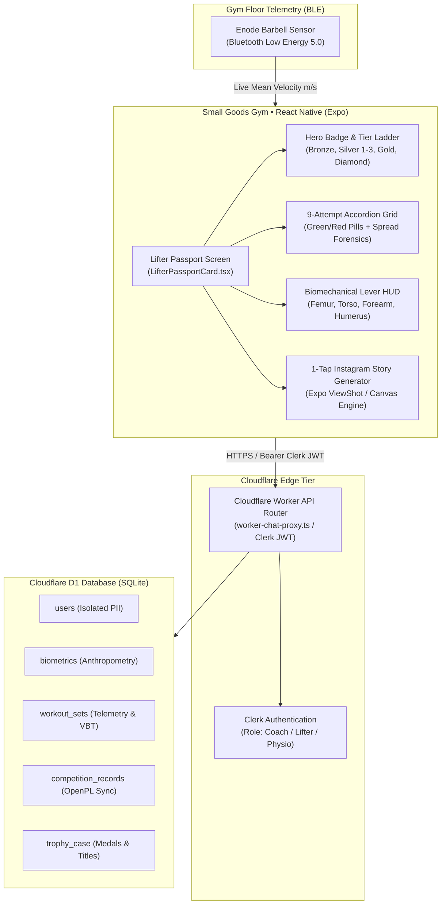

# Small Goods Gym • Arena Powerlifting Benchmark & "Lifter Passport" Blueprint
**Document ID:** SGG-ANALYSIS-001  
**Date:** September 16, 2026 (Updated September 19, 2026 for React Native & Cloudflare Architecture)  
**Author:** Kamilla Gafurzianova, OLY  
**Stakeholders:** Kamilla Gafurzianova, OLY (Sports Technology Systems Architecture), Joel Mullen (Founder & Head Coach, Small Goods Gym), Javier Pereira (Lead Systems Developer)  
**Context:** Comprehensive deconstruction of [Arena Powerlifting Amie Culverson Profile](https://arenapowerlifting.com/u/amie-culverson-3096a8e764f1) forwarded by Joel Mullen via WhatsApp (*"My client just sent me this in case it inspires you"*).  

---

## 1. Executive Summary & Core Strategic Takeaways

The link forwarded by Joel represents a critical psychological pivot in how competitive powerlifters perceive digital tools. Historically, strength athletes relied on **OpenPowerlifting.org**: a sterile, utilitarian database that presents raw competition results as black-and-white spreadsheet rows.

**Arena Powerlifting (ArenaPL)** successfully solved the *athletic identity problem*. It wraps public competition scraping into an esports-grade, gamified athlete profile complete with tier ranks (*"Silver 2"*), digital trophy cases, 9-attempt visual timelines, and 1-click Instagram story export cards.

### Core Metrics from Profile (Amie Culverson):
- **Division:** Masters 1 (40–49), 69kg Female Weight Class
- **Location & Federation:** Western Australia (Perth-adjacent), APLA / APU (IPF Affiliates)
- **Best SBD / Total:** 132.5 kg Squat / 67.5 kg Bench / 165 kg Deadlift / 365 kg Total
- **IPF GL Points / Tier:** 76.93 GL Points • Ranked "Silver 2" (Top 19% Worldwide Masters 1)
- **Trophy Case:** 3x National Champion, 4x State Champion
- **Career Attempt Forensics:** 89% overall make rate; 80% 3rd attempt conversion (Squat 60%, Bench 80%, Deadlift 100%); Average spreads: +6.5kg SQ, +3kg BP, +11kg DL.

**The Strategic Opportunity:** Arena Powerlifting is an *observational spectator tool*. It has zero real-time barbell velocity (VBT), zero biomechanical lever modeling, zero fatigue triage, and zero gym-floor coaching utility. Small Goods Gym is a *gym-floor operating system*. By infusing Small Goods Gym with an ArenaPL-style **"Lifter Passport"** native mobile interface in **React Native (Expo)**, Joel gains both the stickiest athlete community tool in Western Australia and an unassailable technological moat.

---

## 2. Lifter Passport Architecture: React Native & Cloudflare D1

---

## 3. Forensic Profile Analysis: Amie Culverson & Local Perth Ecosystem

- **Local Perth Powerlifting Context:** Amie Culverson competes directly in the WA State Championships and APU Mega Nationals. Her competitive ecosystem directly overlaps with Small Goods Gym athletes in Morley, Perth.
- **Why Joel's Client Sent It:** The client saw an athlete peer's records packaged into a high-status digital badge. Powerlifters train for months for 9 attempts on the platform; having their achievements celebrated as an esports hero card creates immense psychological validation.

---

## 4. Detailed UX & Feature Deconstruction of Arena Powerlifting

### A. Visual Architecture & Esports Gamification
- **Dark-Mode Slate Canvas (`#0d1117`):** Creates an elite, focused training vibe distinct from sterile corporate apps.
- **Tier Ranking Ladder:** Translating abstract IPF GL points into familiar tier badges (*Bronze, Silver 1–3, Gold, Platinum, Diamond*) creates game-like progression.
- **Interactive Trophy Case:** Gold/Silver/Bronze championship medals showcased directly under the avatar.

### B. The 9-Attempt Accordion Grid
- Replaces raw tables with visual green/red attempt pills:
  * Squat: 122.5kg (✓), 127.5kg (✓), 132.5kg (✗)
  * Bench: 62.5kg (✓), 65kg (✓), 67.5kg (✓)
  * Deadlift: 145kg (✓), 155kg (✓), 165kg (✓)
- Displays jump spreads (+5kg, +2.5kg, +10kg) to reveal pacing.

### C. Attempt Analytics (Coaching Forensics)
- **Make Rate by Lift:** SQ 80%, BP 87%, DL 100%.
- **3rd Attempt Conversion:** Highlights clutch execution under maximum load.
- **Average Jump Spread:** Informs optimal attempt selection for upcoming meets.

### D. Advanced Stats & Lift Proportions
- **SBD Proportion Bar:** Squat 36.3%, Bench 18.5%, Deadlift 45.2% (classic deadlift-dominant puller profile).
- **Percentile Dials:** Global IPF Top 19%, Federation APLA Top 41%.
- **Social Hooks:** 1-tap Instagram Story export card generator.

---

## 5. Architectural Gap Analysis: ArenaPL vs. Small Goods Gym

| Dimension / Capability | Arena Powerlifting (ArenaPL) | Small Goods Gym (Current Live Suite) | Small Goods Gym ("Lifter Passport" Target) |
| :--- | :--- | :--- | :--- |
| **Core Focus** | Historical competition scraper | Gym-floor coaching operating system | Unified Gym-Floor OS + Competitive Passport |
| **Platform Target** | Web application | React Native / Expo Native App | React Native (iOS/Android) + Web PWA |
| **Data Ingestion** | Scraped public meet archives | Tactile keypad + Enode VBT BLE | OpenPowerlifting sync + Real-time floor logs |
| **Barbell Velocity** | None (0%) | Real-time Enode m/s & drop-off curves | Correlates gym VBT speed to meet attempt success |
| **Biomechanical Levers** | None (0%) | 4-Segment Cleather moment arms | Connects femur & arm ratios to SBD lift proportions |
| **Missed Lift Triage** | None (Post-hoc record only) | 90-sec neurological triage (Goat AI) | 90-sec triage + Meet-day attempt adjustment |
| **Gym Operations Cap** | None (Public website) | 12-platform cap + WhatsApp waitlist bot | 12-platform cap + Member passport privileges |
| **Visual Gamification** | High (Tiers, medals, badges) | Functional floor logger + Webflow tokens | Full esports tiers styled with Inch Worm (#9aef0f) |
| **Social / Viral Export** | Instagram Story generator | Internal demo & team sharing | 1-tap branded Small Goods Gym PR Story Card |

---

## 6. The Blueprint: The "Small Goods Lifter Passport" Module

1. **Athlete Hero Card:** Dark slate background (`#0d1117`) with Small Goods Gym brand tokens (Inch Worm `#9aef0f`, Purple Heart `#4724ba`, Sweet Corn `#f8ef8d`).
2. **Dual-Mode Toggle:** 
   - *Meet Mode:* 9-attempt accordion, official SBD records, IPF GL points, and WA State Championship medals.
   - *Training Mode:* Current training block volume, 30-day Enode VBT mean velocity on top sets, and Dr. Dan Cleather 4-segment leverage score.
3. **Smart Attempt Modeler:** Calculates recommended 2nd and 3rd attempts on meet day based on athlete's historical spreads and gym-floor VBT speed.
4. **Branded Instagram Story Generator:** 1-click export of an athlete's PR card featuring the Small Goods Gym goat emblem.

---

## 7. Strategic Alignment for Joel and Javier

### Talking Points for Joel Mullen (Founder & Head Coach):
> *"Joel, that link your client sent confirms something we already know about lifters: they love feeling like elite athletes with rank badges, attempt cards, and trophy cases. OpenPowerlifting gives them a sterile spreadsheet; ArenaPL gives them an esports card. What we're delivering for Small Goods Gym gives them that exact same esports pride: but instead of being an empty website that only updates twice a year after a meet, it lives natively in their pocket in React Native, tracks their daily bar speed on your platforms, and enforces your 12-lifter coaching cap."*

### Talking Points for Javier (Lead Systems Developer):
> *"Javier, this ArenaPL concept is strictly a front-end presentation component in our React Native package (`LifterPassportCard.tsx`). It connects directly into your Cloudflare Workers and Cloudflare D1 (SQLite) backend without schema breaking changes. Meet records and attempt history map cleanly to lightweight SQLite tables (`competition_records`, `trophy_case`), keeping edge query latency under 15ms."*

---

## 8. Verification & Implementation Roadmap
1. **Component Packaging (Complete):** Built `LifterPassportCard.tsx` inside `expo-handover/components/` incorporating the 9-attempt accordion and GL Points tier badge.
2. **Database Schema (Cloudflare D1):** Added `competition_records` and `trophy_case` tables to `schema-cloudflare-d1.sql`.
3. **Hardware Connectivity:** Native iOS BLE manager binds Enode puck velocity metrics directly to the athlete's training card.
