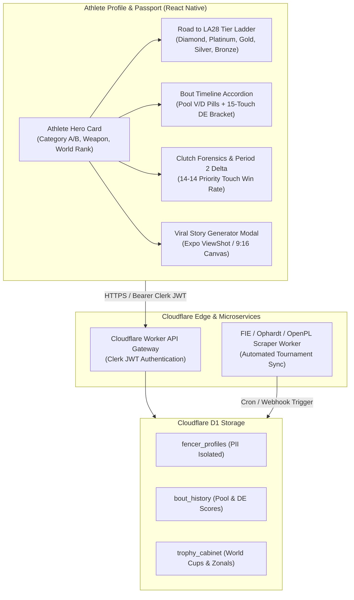

# USA Parafencing & Small Goods Gym • ArenaPL Benchmark & Social Gamification Blueprint
**Document ID:** SGG-PF-ANALYSIS-002  
**Date:** September 16, 2026 (Updated September 19, 2026 for React Native Architecture)  
**Author:** Kamilla Gafurzianova, OLY  
**Stakeholders:** Kamilla Gafurzianova, OLY (Sports Technology Systems Architecture), Joel Mullen (Small Goods Gym), Javier Pereira (Lead Systems Developer)  

---

## 1. Strategic Cross-Pollination Thesis
The athlete profile architecture from **Arena Powerlifting** ([arenapowerlifting.com](https://arenapowerlifting.com/u/amie-culverson-3096a8e764f1)) forwarded by Joel Mullen solves the exact visual, psychological, and storytelling challenges faced in the **USA Parafencing Road to LA28** platform (`parafencing-project`).

Traditional sports databases (OpenPowerlifting in strength, FIE/Ophardt in fencing) are sterile administrative spreadsheets. By adopting ArenaPL's **esports gamification**, **9-attempt/bout timeline accordions**, **clutch forensics**, and **1-click viral Instagram Story generators**, we elevate Team USA adaptive athletes into celebrated heroes, create immense athlete retention, and build an automated organic sponsor acquisition engine for the Road to LA28.

---

## 2. Gamification Architecture & Flow

---

## 3. The Gamification Layer: Road to LA28 Tier Ladder
Arena Powerlifting successfully converted abstract IPF GL points (e.g. 76.93) into a recognizable tier badge (*"Silver 2"*). In USA Parafencing, world rankings and qualification points are often opaque to athletes and sponsors.

We establish a formal, gamified **LA28 Competitive Ladder** within `AthleteProfileView.tsx`:
1. **Diamond Tier:** World Rank 1–4 • Direct Paralympic Quota Holder
2. **Platinum Tier:** World Rank 5–8 • Active Quota Contender (Podium Candidate)
3. **Gold Tier:** World Rank 9–16 • World Cup Direct Elimination Core
4. **Silver Tier:** World Rank 17–32 / Top 3 USA • National Team Core
5. **Bronze Tier:** Domestic Circuit / Grassroots • 2032 Runway

---

## 4. Bout Forensics vs. Powerlifting Attempt Analytics
- **The 14-14 Priority Touch (The 3rd Attempt Make Rate Analog):**
  $$\text{Clutch Win Rate (\%)} = \left(\frac{\text{Bouts Won at 14-14}}{\text{Total Bouts Reaching 14-14}}\right) \times 100$$
- **The 9-Attempt Accordion vs. Pool & DE Bout Matrix:**
  Expandable green (V) and red (D) pills showing 5-touch pool cards with touch indicator (`Ind`) and 15-touch DE progression.
- **Period 2 Adjustment Delta:**
  Measures whether an athlete gained or lost ground after the 1-minute break, providing a quantitative score for tactical coachability.
- **Tactical Action Distribution Bar:**
  Analog to SBD lift proportions, showing % touches scored via Attack on Prep vs. Parry-Riposte vs. Counter-Attack vs. Remise.

---

## 5. The Viral Social Media Engine: 1-Click Story Card Generator
Five tailor-made card templates for USA Parafencing:
1. **World Cup Podium Alert (9:16 Story)**
2. **Road to LA28 Quota Tracker (9:16 Story & 1:1 Feed)**
3. **Bout Day Matchup & Result Card (1:1 Feed & 16:9 Landscape)**
4. **Athlete Strip Passport / Digital Trading Card (4:5 Portrait)**
5. **Career Milestone & Personal Record Alert (9:16 Story)**

Strict brand standards:
- WCAG AAA contrast (white text on Navy `#131F48` >= 13:1).
- Mandatory crisp white backing on weapon illustrations (per `DESIGN.md` line 24).
- Single-line invariant on badges and buttons.
- Official fencing notation: W, V, D, TS, TR, Ind.

---

## 6. Technical Implementation Plan in React Native
- `<AthleteHeroPassport />` component in React Native (Expo) using native `View`, `Text`, and `Pressable`.
- `<TrophyCabinet />` component mapping `recentCompetitions` medals with dynamic glow effects.
- `<BoutTimelineAccordion />` mapping pool and DE rounds with haptic feedback on touch.
- `<SocialStoryModal />` using `react-native-view-shot` for zero-latency 3× Retina mobile sharing to Instagram Stories.
- Direct edge data hydration from Cloudflare Workers and Cloudflare D1 (SQLite) backend.
