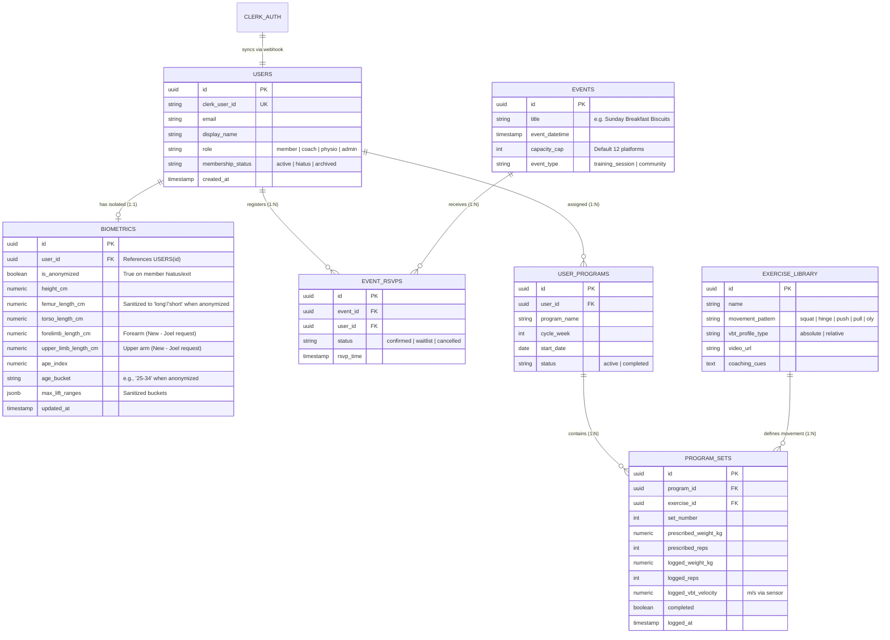

# Small Goods Gym • Technical Alignment Debrief & Systems Architecture
**Document ID:** SGG-COMM-002  
**Meeting Date:** Friday, September 18, 2026 | 21:34 – 22:16 PT (Saturday, September 19, 2026 | 12:34 – 13:16 AWST Perth)  
**Participants:**
- **Kamilla Gafurzianova, OLY ("Mila")** — Sports Technology Architect; Head Coach, USA Parafencing National Team
- **Joel Mullen** — Founder & Head Coach, Small Goods Gym (Morley, Perth, WA)
- **Javier Pereira** — Lead Systems Developer, Small Goods Gym

---

## 1. Executive Summary

Joel Mullen, Javier Pereira, and Kamilla Gafurzianova convened for a 42-minute 3-way technical alignment call to audit the live prototypes, uncover the exact production stack built by Javier, reconcile architectural assumptions, and establish a frictionless handoff protocol ahead of the **February 2027 MVP launch**.

### Key Outcomes & Agreements:
1. **Production Stack Unveiled:** Javier's stack is **Expo (React Native)** on the frontend, **Cloudflare Workers** on the backend, **Cloudflare D1 (SQLite)** for relational persistence, and **Clerk** for authentication. It is not Next.js or PostgreSQL.
2. **Native iOS Strategy:** React Native / Expo was chosen specifically to unlock native iOS Bluetooth APIs required to interface with accelerometers and VBT hardware. The app currently compiles to web and will package directly for native iOS.
3. **Biometrics & GDPR Compliance:** Anthropometric data (femur, torso, and newly added arm/forelimb measurements) will be isolated in a dedicated `biometrics` table decoupled from personally identifiable information (PII). An automated anonymization pipeline will sanitize data when members leave or pause memberships.
4. **Goat AI Integration Path:** The AI Co-Pilot will be exported as React Native components for Expo; the Cloudflare Worker will act as a lightweight, secure reverse proxy to Google Gemini API / Google AI Studio. Joel will supply his gym-floor coaching methodology and philosophy to ground the RAG knowledge base.
5. **Asynchronous Channel Shift:** Regular long Zoom calls across opposing time zones will be replaced with asynchronous, rapid check-ins inside the existing **Small Goods App WhatsApp group (`SG app`)**.
6. **Camp Deadline:** Kamilla departs for an international training camp in 2.5 days. Deliverables are time-boxed to high-signal visual diagrams and cleaned up UI/chatbot code by Monday morning Perth time.

---

## 2. Technical Stack Audit & Reconciliation

| Layer | Initial External Assumption | Javier's Verified Production Stack | Rationale & Architectural Implication |
| :--- | :--- | :--- | :--- |
| **Frontend Client** | Next.js PWA | **Expo (React Native)** | iOS WebKit restricts Bluetooth access. React Native enables native Bluetooth communication with VBT sensors and barbell accelerometers. Compiles to web now, packages to iOS later. |
| **Backend Compute** | FastAPI / Dedicated Server | **Cloudflare Workers** (Serverless Edge) | Eliminates permanent idle compute costs ($5+/hr). First 1M requests are free; scales globally with sub-millisecond edge routing. |
| **Database** | PostgreSQL | **Cloudflare D1 (SQLite)** | Substantially less expensive; 3× 10GB databases included for free. Fast relational queries with zero server management. |
| **Authentication** | Custom Cloudflare Auth | **Clerk** (Token/JWT-based) | Offloads user security and session management. Synced with local `users` and permissions table in D1. |
| **Object / Media Storage** | Google Cloud Storage | **Cloudflare R2 / S3-compatible** | Used for exercise video demonstrations, member clips, and media assets behind Worker endpoints. |
| **AI Co-Pilot** | Google Cloud Run / Firebase | **Cloudflare Worker Proxy → Gemini API** | Worker holds the API secrets and proxies member prompts to Gemini; UI renders in Expo. |

---

## 3. Database Architecture & Relational Schema Boundary

Javier and Kamilla aligned on a clean relational model in SQLite (Cloudflare D1). Rather than unstructured NoSQL, structured relational tables guarantee consistency across the gym floor.

### Privacy, PII Isolation & Anonymization Pipeline
- **Legal & PII Protection:** Storing biometric data (body proportions, limb dimensions, health metrics) directly in the `users` table introduces legal liability under California PII and European GDPR frameworks.
- **Decoupled Biometrics:** Anthropometric data resides in a separate `biometrics` table keyed by internal `user_id`.
- **Hiatus / Offboarding Scrub:** When an athlete goes on hiatus or terminates their membership:
  - Exact femur and limb measurements are sanitized into categorical levers (`long_femur`, `short_torso`, `balanced`).
  - Exact age is converted into an age bucket (e.g., `25–34`).
  - Max lifts are converted into performance tiers.
  - This preserves historical research and aggregate analytics without retaining identifiable personal profiles.

---

## 4. Expansion of Anthropometric Model: Upper Limb Kinematics

During the call, Joel requested expanding the leverage model:
- **Prior Focus:** Femur-to-torso ratio (squat mechanics, knee/hip sagittal moment arms).
- **New Requirement:** Forearm (forelimb) and upper arm (humerus) measurements.
- **Biomechanical Value:**
  - **Bench Press:** Arm length relative to torso depth dictates the range of motion and shoulder internal rotation torque at the chest.
  - **Deadlift:** Arm span to femur ratio determines starting hip height, back angle, and whether conventional or sumo minimizes lumbar shear.
  - **Olympic Weightlifting:** Forearm length dictates the front rack elbow elevation angle and snatch turnover clearance.

---

## 5. Goat AI Sports-Science Co-Pilot Roadmap

1. **Current Baseline:** Kamilla demonstrated the functional prototype indexed on Yuri Verkhoshansky, Vladimir Zatsiorsky, and Dr. Dan Cleather with deterministic 90-second missed-lift triage.
2. **Joel's Gym-Floor Methodology:** Joel noted that while the sports science grounding is solid, the bot must reflect Small Goods' proprietary gym-floor coaching culture, movement standards, and verbal cues.
3. **Action:** Joel will provide a structured methodology/philosophy document. Kamilla will ingest and index this content into the RAG pipeline.
4. **Expo / Worker Integration:**
   - Kamilla will export the Chatbot UI as clean React Native components compatible with Expo.
   - Javier will wire the component to a Cloudflare Worker endpoint (`POST /api/chat`) that securely proxies prompts to the Gemini API using server-side API keys.

---

## 6. Action Items & Next Steps

| # | Action Item | Owner | Target Date | Status |
| :--- | :--- | :--- | :--- | :--- |
| **1** | Provide high-level system architecture diagram and core ~6 database table list | Javier | Monday, Sep 21 (Perth) | **Pending** |
| **2** | Draft Small Goods coaching philosophy, gym principles, and cueing document | Joel | Monday, Sep 21 (Perth) | **Pending** |
| **3** | Add Kamilla to the **Small Goods App WhatsApp group (`SG app`)** | Joel / Javier | Immediate | **Pending** |
| **4** | Clean up UI code and export Goat AI Chatbot component for Expo / React Native | Kamilla | Monday, Sep 21 (Perth) | **In Progress** |
| **5** | Update anthropometry model to include forearm and upper arm limb calculations | Kamilla | Monday, Sep 21 (Perth) | **In Progress** |
| **6** | Ingest Joel's coaching philosophy into the RAG vector base | Kamilla | Post-Ingestion | **Pending** |
| **7** | Implement Cloudflare Worker proxy endpoint for Gemini API | Javier | Post-Handoff | **Pending** |
