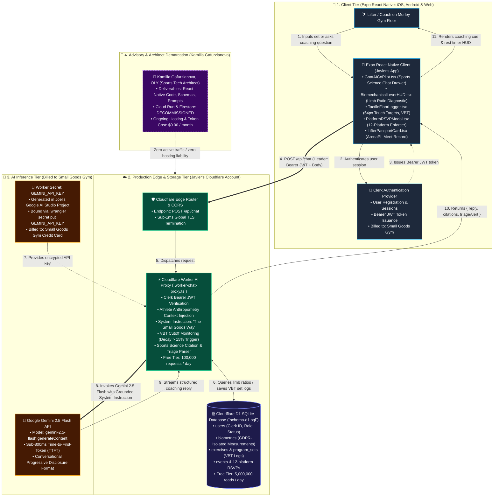

# Small Goods Gym • Production Infrastructure & Zero-Cost Handover Architecture

**Document ID:** SGG-ARCH-007  
**Version:** 1.0.0 (Production Verified)  
**Date:** September 19, 2026  
**Status:** Approved & Handoff Ready  
**Authors:** Kamilla Gafurzianova, OLY ("Mila") & Sports Technology Architecture Team  
**Audience:** Joel Mullen (Founder & Head Coach), Javier Pereira (Lead Systems Developer), Kamilla Gafurzianova  

---

## Visual Architecture Assets

- **Vector SVG (Infinite Zoom / Mobile Retina Master):** [production-infrastructure-architecture.svg](./assets/production-infrastructure-architecture.svg)
- **Interactive Markdown Mermaid Source:** Fully rendered inline in [Section 2](#2-production-infrastructure--data-flow-architecture).

---

## 1. Executive Summary & Financial Boundary Demarcation

Following the September 18, 2026 technical alignment call between Joel Mullen, Javier Pereira, and Kamilla Gafurzianova, the production architecture was definitively decoupled from all external Google Cloud Run and Firebase prototype containers.

### The Zero-Cost Rule for Kamilla Gafurzianova:
- **Kamilla's Hosting & Infrastructure Bill:** **$0.00 / month (Zero recurring liability).**
- **Decommissioned Systems:** All temporary Cloud Run containers and Firebase Firestore instances utilized during the exploratory sports-science RAG phase are decommissioned. Kamilla does **not** host, run, or pay for any production services, databases, or API tokens.
- **Production Ownership:** Small Goods Gym and Javier Pereira assume 100% operational, technical, and financial ownership of the production stack. The entire bot engine, Joel's coaching philosophy, and real-time biomechanical triage rules have been compiled into a drop-in serverless package in [`expo-handover/`](../expo-handover/) running natively inside Javier's Cloudflare infrastructure.

---

## 2. Production Infrastructure & Data Flow Architecture

The following diagram defines the 4 core architectural tiers, the data flow, and the strict ownership/billing boundary:



---

## 3. Infrastructure Ledger & Billing Accountability Matrix

Every production service is mapped directly to its billing account, free tier threshold, and financial owner. **Kamilla Gafurzianova's financial liability is explicitly zero across all layers.**

| Service / Resource | Purpose | Provider & Environment | Free Tier Allowance | Production Billing Owner | Kamilla's Monthly Cost |
| :--- | :--- | :--- | :--- | :--- | :--- |
| **Mobile App Shell** | iOS & Android Member App | Expo Application Services (EAS) / App Store | Standard open-source Expo CLI | Small Goods Gym / Javier | **$0.00** |
| **Authentication** | User login, JWT sessions, roles | Clerk | 10,000 Monthly Active Users (MAU) | Small Goods Gym | **$0.00** |
| **AI Reverse Proxy** | Routes chat & executes VBT rules | Cloudflare Workers (`worker-chat-proxy.ts`) | 100,000 requests / day free | Small Goods Gym / Javier | **$0.00** |
| **Relational Database** | Users, PII-isolated biometrics, sets | Cloudflare D1 (SQLite - `schema-cloudflare-d1.sql`) | 5,000,000 reads / day free | Small Goods Gym / Javier | **$0.00** |
| **Media / Demonstration Storage** | Movement demo videos & lifter clips | Cloudflare R2 | 10 GB storage free | Small Goods Gym / Javier | **$0.00** |
| **LLM Inference** | Sports science coaching & triage | Google Gemini 2.5 Flash via AI Studio | 15 RPM / 1M TPM free tier; fractions of a cent thereafter | Small Goods Gym (Joel Mullen's account) | **$0.00** |
| **Legacy Cloud Run / Firestore** | Prototype development container | Google Cloud Platform | **DECOMMISSIONED** | **DECOMMISSIONED** | **$0.00** |

---

## 4. Architectural Component Deep Dive

### 4.1 Client Layer: Expo React Native (`expo-handover/components/`)
All mobile UI components are built using pure React Native and Expo primitives (`View`, `Text`, `TouchableOpacity`, `ScrollView`, `TextInput`, `Modal`), requiring zero browser DOM dependencies:
1. **`GoatAICoPilot.tsx`:** Sports science co-pilot drawer with offline deterministic fast-path fallback and streaming chat interface.
2. **`BiomechanicalLeverHUD.tsx`:** 4-segment anthropometry diagnostic calculating joint moment arms and stance adjustments for femurs, torso, upper arm (humerus), and forearm (forelimb).
3. **`TactileFloorLogger.tsx`:** High-contrast gym-floor workout logger featuring $64\times64\text{ dp}$ touch targets, Enode/VBT speed logging ($m/s$), and automatic CNS fatigue alerts when bar velocity drops $>15\%$.
4. **`PlatformRSVPModal.tsx`:** Enforces Small Goods Gym's strict 12-platform capacity cap with automated waitlist queueing.
5. **`LifterPassportCard.tsx`:** Arena Powerlifting-style competitive passport featuring a visual 9-attempt accordion grid and IPF GL points tier ladder.

### 4.2 Serverless Edge Layer: Cloudflare Worker (`expo-handover/worker/worker-chat-proxy.ts`)
The Cloudflare Worker functions as the secure AI gateway:
- **CORS Handling:** Handles preflight `OPTIONS` and permits cross-origin requests from the Expo app on mobile and web.
- **Clerk JWT Verification:** Inspects incoming `Authorization: Bearer <token>` headers to guarantee requests originate from authenticated Small Goods members.
- **Biomechanical Prompt Grounding:** Automatically binds the member's limb ratios (`femurToTorsoRatio`, `forearmToArmRatio`, `leverageTags`) into the prompt.
- **Ingestion of "The Small Goods Way":** Hardcodes Joel Mullen's 5 movement categories (*Range Adders $\to$ Co-ordinators $\to$ Accelerators $\to$ Force Builders $\to$ Volume Builders*), MED grinder limits, and the Universal Conversational Accessibility Protocol.
- **VBT Alert Parsing:** Detects velocity drop keywords and returns structured programmatic alerts (`triageAlert: { type: 'drop_load', action: 'Drop load 5%-7.5%' }`).

### 4.3 Database Layer: Cloudflare D1 (`expo-handover/database/schema-cloudflare-d1.sql`)
An 8-table relational SQLite schema hosted entirely within Javier's Cloudflare account:
- **Strict PII Separation:** Personally identifiable information (`users`) is decoupled from physical measurements (`biometrics`).
- **Automated Anonymization Trigger:** SQLite trigger `trg_anonymize_member_biometrics` wipes millimetric limb lengths when a member transitions to hiatus or archived status, preserving non-identifiable categorical tags (`["long_femur"]`) for gym-wide biomechanical modeling.

---

## 5. Javier's Deployment Runbook (Zero-Friction Setup)

Javier can deploy the complete AI backend to his Cloudflare account in under 3 minutes:

### Step 1: Clone or Copy the Handover Package
```bash
cd expo-handover/worker
```

### Step 2: Configure the Secret (Billed to Small Goods)
Joel or Javier generates an API key in [Google AI Studio](https://aistudio.google.com/) using Small Goods Gym's Google account:
```bash
npx wrangler secret put GEMINI_API_KEY
# Enter Small Goods Gym's Gemini API key when prompted
```

### Step 3: Deploy the Worker to Javier's Cloudflare Account
```bash
npx wrangler deploy
```
*The Worker is now live at `https://<javier-subdomain>.workers.dev/api/chat` or mapped to `https://api.smallgoodsgym.com.au/api/chat`.*

### Step 4: Execute the D1 Database Schema
```bash
cd ../database
npx wrangler d1 execute small_goods_d1 --file=./schema-cloudflare-d1.sql
```

### Step 5: Connect Expo Components
In the Expo mobile project:
```tsx
import { GoatAICoPilot } from './components/GoatAICoPilot';

<GoatAICoPilot
  visible={isChatOpen}
  onClose={() => setIsChatOpen(false)}
  apiEndpoint="https://api.smallgoodsgym.com.au/api/chat"
  clerkToken={sessionToken}
  athleteProfile={{
    name: user.displayName,
    femurToTorsoRatio: 1.15,
    forearmToArmRatio: 0.92,
    leverageTags: ['Long Femurs', 'Long Forearms'],
  }}
/>
```

---

## 6. Verification & Decommissioning Sign-Off

1. **Client Isolation:** The mobile app never contains API keys, database credentials, or secret tokens.
2. **Serverless Scalability:** Cloudflare Workers and D1 require zero container orchestration, zero patch management, and zero idle server costs.
3. **Financial Protection:** Kamilla Gafurzianova has zero billing accounts attached to the production Small Goods Gym runtime.
