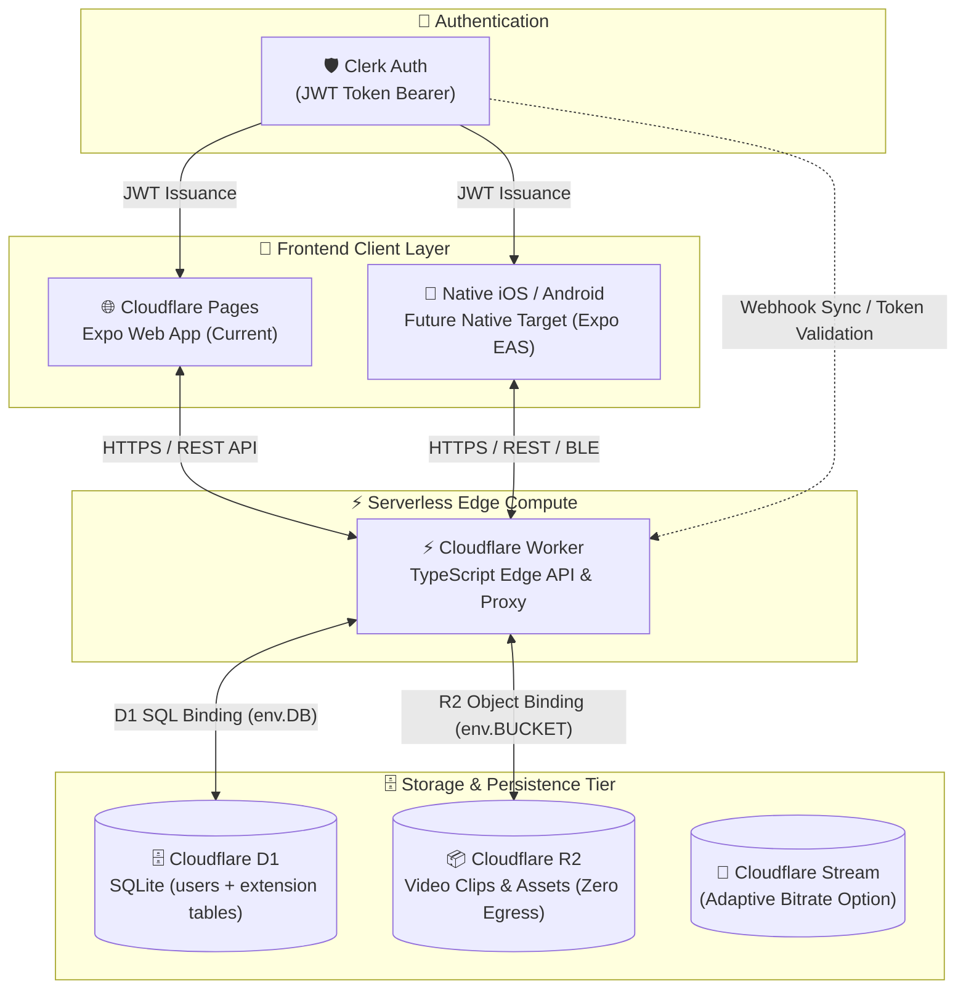
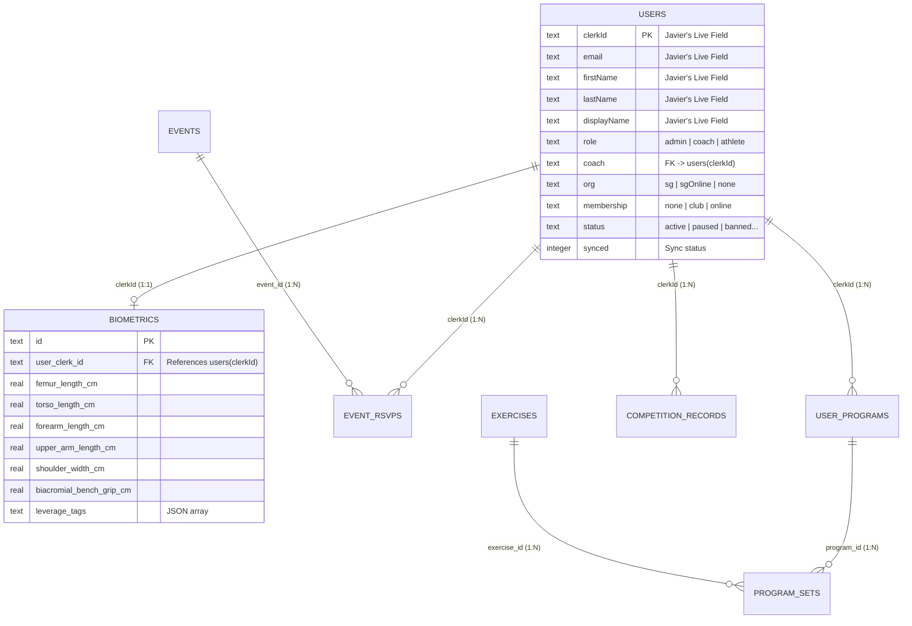

# Small Goods Gym • Javier Architecture Overview Review & D1 Schema Reconciliation

**Document ID:** SGG-ARCH-008  
**Date:** September 22, 2026  
**Source Artifact:** `SGApp Architecture Overview.pdf` (Received from Joel Mullen on behalf of Javier Pereira)  
**Author:** Kamilla Gafurzianova, OLY ("Mila"), Sports Technology Systems Architect  
**Audience:** Javier Pereira (Lead Systems Developer), Joel Mullen (Founder & Head Coach), Izzy (Software/Community)  

---

## 1. Executive Summary & Communication Context

On September 22, 2026, Joel Mullen forwarded the foundational architecture brief prepared by Lead Developer Javier Pereira (`SGApp Architecture Overview.pdf`, 55 KB). 

```
WhatsApp Thread Context:
• Joel Mullen: "Having issues adding you into the WApp group lol. Javi said to pass this on"
• Joel Mullen: "Izzy said she'll sort out adding you to the software group tomorrow"
• Reference Repository: https://github.com/Bulachak/small-goods-gym/tree/main/docs
• Kamilla: Traveling to National Team Coach training camp (slower response until Sunday).
```

This review verifies Javier's architecture topology, confirms 100% alignment with our React Native / Cloudflare design, and provides an immediate reconciliation strategy between Javier's live `users` table in Cloudflare D1 and our sports-science / biomechanics extension tables.

---

## 2. Architecture Review & Validation



### Key Architectural Findings:
1. **Frontend Hosting (Cloudflare Pages + Expo Web):**
   - Javier is hosting the web version of the Expo app on **Cloudflare Pages**.
   - Because Expo web compiles to a static single-page application (SPA), Cloudflare Pages provides unlimited bandwidth, instant global CDN caching, and automatic branch previews from git commits at **$0 hosting cost**.
   - The codebase seamlessly bridges to the **Future Native Target** (iOS/Android) using Expo Application Services (EAS), unlocking native Bluetooth for Enode/VBT linear transducers.

2. **Compute Tier (Cloudflare Worker in TypeScript):**
   - The Cloudflare Worker handles all API routing, Clerk JWT validation, D1 queries, and Gemini AI proxying.
   - Zero cold starts, sub-millisecond edge latency in Perth, and 100,000 requests/day on Cloudflare's free tier.

3. **Storage & Video Strategy (Cloudflare R2 vs. Cloudflare Stream):**
   - Javier correctly observed: *"For storage and video Cloudflare has R2 and Stream. R2 is significantly cheaper than stream for large volume."*
   - **Cost Comparison:**
     - **Cloudflare Stream:** \$5/month for 1,000 minutes of stored video + \$1/month per 1,000 minutes viewed. For 100 lifters uploading 3 form-check sets daily (300 clips/day), costs scale quickly.
     - **Cloudflare R2:** S3-compatible object storage with **$0 egress fees**, \$0.015/GB/month storage, and 10GB free tier. Storing compressed 10-second mobile MP4 clips (~3MB each) directly in R2 saves hundreds of dollars per year while remaining ultra-fast.
   - **Recommendation:** Standardize on **Cloudflare R2** for workout recordings and exercise demonstration clips, utilizing direct presigned upload URLs generated by the Cloudflare Worker.

---

## 3. Live D1 `users` Table Schema Audit

Javier confirmed that production currently operates with **one single `users` table** in D1 with the following structure:

### Production Columns:
`clerkId email firstName lastName displayName role coach org membership status synced`

### Domain Enums & Column Semantics:

| Column | Type | Allowed Values / Semantics | Integration Notes |
| :--- | :--- | :--- | :--- |
| **`clerkId`** | `TEXT PRIMARY KEY` | Unique Clerk User ID (`user_2...`) | Acts as the primary foreign key target for all extension tables. |
| **`email`** | `TEXT` | Athlete / Coach email | Synchronized from Clerk identity. |
| **`firstName`** | `TEXT` | Given name | Used for personalized coach greetings. |
| **`lastName`** | `TEXT` | Family name | Member roster search. |
| **`displayName`**| `TEXT` | Preferred gym-floor name | Rendered on leaderboard & platform HUD. |
| **`role`** | `TEXT` | `'admin' \| 'coach' \| 'athlete'` | **Crucial:** Uses `'athlete'` instead of `'member'`. |
| **`coach`** | `TEXT` | Reference to another user with `role = 'coach'` | Stores the `clerkId` of the athlete's primary coach. |
| **`org`** | `TEXT` | `'sg' \| 'sgOnline' \| 'none'` | Separates physical Morley members (`sg`) from remote lifters (`sgOnline`). |
| **`membership`** | `TEXT` | `'none' \| 'club' \| 'online'` | Tiered access control. |
| **`status`** | `TEXT` | `'none' \| 'active' \| 'paused' \| 'banned' \| 'locked'` | Directly maps to Clerk account lifecycle states. |
| **`synced`** | `INTEGER / TEXT` | Webhook sync flag / timestamp | Tracks consistency between Clerk and D1. |

---

## 4. D1 Extension Schema: Seamless Non-Breaking Additions

Javier noted: *"We will need to add tables for any new data."*

To ensure **zero breaking changes** to Javier's live `users` table while introducing all sports-science, biomechanical, and 12-platform features, our schema updates conform to the following rules:

1. **Foreign Key Target:** All new tables reference `users(clerkId)` directly (not an abstract `id`).
2. **Role Compatibility:** Any role-based logic recognizes `role = 'athlete'` as standard lifters.
3. **GDPR Anonymization Trigger:** Realigned to fire when `NEW.status IN ('paused', 'banned', 'locked')`.



---

## 5. Drop-In D1 Migration Script for Javier

The following SQL script (`schema-cloudflare-d1.sql`) can be run directly via Wrangler CLI:
`wrangler d1 execute <DB_NAME> --file=./schema-cloudflare-d1.sql`

```sql
-- ==============================================================================
-- Small Goods Gym • D1 Migration (Extension Tables for Javier's Stack)
-- Target: Cloudflare D1 SQLite Database
-- Assumes existing 'users' table with clerkId as primary key
-- ==============================================================================

-- 1. BIOMETRICS TABLE (Isolated for Privacy & GDPR / PII Compliance)
CREATE TABLE IF NOT EXISTS biometrics (
    id TEXT PRIMARY KEY,
    user_clerk_id TEXT UNIQUE NOT NULL,
    is_anonymized INTEGER DEFAULT 0 CHECK(is_anonymized IN (0, 1)),
    
    -- Anthropometric Measurements (cm)
    height_cm REAL,
    femur_length_cm REAL,
    torso_length_cm REAL,
    upper_arm_length_cm REAL,                 -- Humerus
    forearm_length_cm REAL,                   -- Forelimb
    shoulder_width_cm REAL,                   -- Biacromial breadth
    arm_span_cm REAL,
    
    -- Kinematic Ratios
    femur_to_torso_ratio REAL,
    forearm_to_arm_ratio REAL,
    biacromial_bench_grip_cm REAL,            -- 1.6x biacromial breadth
    ape_index REAL,
    
    -- Categorical Lever Tags
    leverage_tags TEXT DEFAULT '[]',          -- e.g. '["long_femur", "short_torso"]'
    age_range TEXT,                           -- e.g. '25-34'
    max_lifts_json TEXT DEFAULT '{}',
    
    updated_at DATETIME DEFAULT CURRENT_TIMESTAMP,
    FOREIGN KEY (user_clerk_id) REFERENCES users(clerkId) ON DELETE CASCADE
);

CREATE INDEX IF NOT EXISTS idx_biometrics_clerk_id ON biometrics(user_clerk_id);

-- 2. EXERCISE LIBRARY (The Small Goods Way 5 Categories)
CREATE TABLE IF NOT EXISTS exercises (
    id TEXT PRIMARY KEY,
    name TEXT NOT NULL,
    category TEXT NOT NULL CHECK(category IN ('range_adder', 'co_ordinator', 'accelerator', 'force_builder', 'volume_builder', 'accessory')),
    movement_pattern TEXT NOT NULL CHECK(movement_pattern IN ('squat', 'hinge', 'push', 'pull', 'olympic', 'other')),
    vbt_profile_type TEXT DEFAULT 'relative',  -- 'absolute' vs 'relative' velocity cutoff
    video_r2_url TEXT,                         -- Cloudflare R2 object URL
    coaching_cues TEXT,
    created_at DATETIME DEFAULT CURRENT_TIMESTAMP
);

-- 3. USER PROGRAMS & MACROCYCLES
CREATE TABLE IF NOT EXISTS user_programs (
    id TEXT PRIMARY KEY,
    user_clerk_id TEXT NOT NULL,
    program_name TEXT NOT NULL,
    macrocycle_block INTEGER DEFAULT 1,       -- 12-week macrocycle (Blocks 1-3)
    cycle_week INTEGER DEFAULT 1,
    status TEXT NOT NULL CHECK(status IN ('active', 'completed', 'paused')) DEFAULT 'active',
    start_date DATE NOT NULL,
    FOREIGN KEY (user_clerk_id) REFERENCES users(clerkId) ON DELETE CASCADE
);

CREATE INDEX IF NOT EXISTS idx_programs_clerk_id ON user_programs(user_clerk_id);

-- 4. PROGRAM SETS & VBT LOGS
CREATE TABLE IF NOT EXISTS program_sets (
    id TEXT PRIMARY KEY,
    program_id TEXT NOT NULL,
    exercise_id TEXT NOT NULL,
    set_number INTEGER NOT NULL,
    prescribed_weight_kg REAL NOT NULL,
    prescribed_reps INTEGER NOT NULL,
    logged_weight_kg REAL,
    logged_reps INTEGER,
    logged_vbt_velocity REAL,                 -- Enode velocity in m/s
    is_completed INTEGER DEFAULT 0 CHECK(is_completed IN (0, 1)),
    cns_fatigue_flag INTEGER DEFAULT 0 CHECK(cns_fatigue_flag IN (0, 1)), -- 1 if velocity drop > 15%
    logged_at DATETIME,
    FOREIGN KEY (program_id) REFERENCES user_programs(id) ON DELETE CASCADE,
    FOREIGN KEY (exercise_id) REFERENCES exercises(id)
);

CREATE INDEX IF NOT EXISTS idx_sets_program_id ON program_sets(program_id);

-- 5. 12-PLATFORM SESSION CAPACITY & EVENT RESERVATIONS
CREATE TABLE IF NOT EXISTS events (
    id TEXT PRIMARY KEY,
    title TEXT NOT NULL,                       -- e.g. "Evening Barbell Session"
    event_type TEXT NOT NULL CHECK(event_type IN ('platform_session', 'community_event', 'clinic')),
    event_datetime DATETIME NOT NULL,
    capacity_cap INTEGER NOT NULL DEFAULT 12,  -- Small Goods 12-Platform Limit
    created_at DATETIME DEFAULT CURRENT_TIMESTAMP
);

CREATE TABLE IF NOT EXISTS event_rsvps (
    id TEXT PRIMARY KEY,
    event_id TEXT NOT NULL,
    user_clerk_id TEXT NOT NULL,
    platform_number INTEGER CHECK(platform_number BETWEEN 1 AND 12),
    status TEXT NOT NULL CHECK(status IN ('confirmed', 'waitlist', 'cancelled')) DEFAULT 'confirmed',
    waitlist_position INTEGER,
    rsvp_time DATETIME DEFAULT CURRENT_TIMESTAMP,
    FOREIGN KEY (event_id) REFERENCES events(id) ON DELETE CASCADE,
    FOREIGN KEY (user_clerk_id) REFERENCES users(clerkId) ON DELETE CASCADE,
    UNIQUE(event_id, platform_number)
);

CREATE INDEX IF NOT EXISTS idx_rsvps_event_id ON event_rsvps(event_id);
CREATE INDEX IF NOT EXISTS idx_rsvps_clerk_id ON event_rsvps(user_clerk_id);

-- 6. GDPR PRIVACY ANONYMIZATION TRIGGER (Matches Javier's status values)
CREATE TRIGGER IF NOT EXISTS trg_anonymize_member_biometrics
AFTER UPDATE OF status ON users
WHEN NEW.status IN ('paused', 'banned', 'locked')
BEGIN
    UPDATE biometrics
    SET 
        is_anonymized = 1,
        height_cm = NULL,
        femur_length_cm = NULL,
        torso_length_cm = NULL,
        upper_arm_length_cm = NULL,
        forearm_length_cm = NULL,
        shoulder_width_cm = NULL,
        arm_span_cm = NULL,
        updated_at = CURRENT_TIMESTAMP
    WHERE user_clerk_id = NEW.clerkId;
END;
```

---

## 6. Next Steps & Coordination Checklist

- [x] **Store Architecture Artifact:** Saved original `SGApp Architecture Overview.pdf` into project root and `docs/`.
- [x] **Reconcile D1 Schema:** Updated foreign key bindings to target Javier's `users.clerkId` and status enums (`active`, `paused`, `banned`, `locked`).
- [ ] **WhatsApp Software Group Onboarding:** Izzy adding Kamilla tomorrow; all rapid check-ins will proceed asynchronously on WhatsApp while Kamilla is at national training camp.
- [ ] **R2 Presigned Upload POC:** Provide Javier with an example 15-line Worker endpoint for generating direct client-to-R2 upload presigned URLs for video clips.
