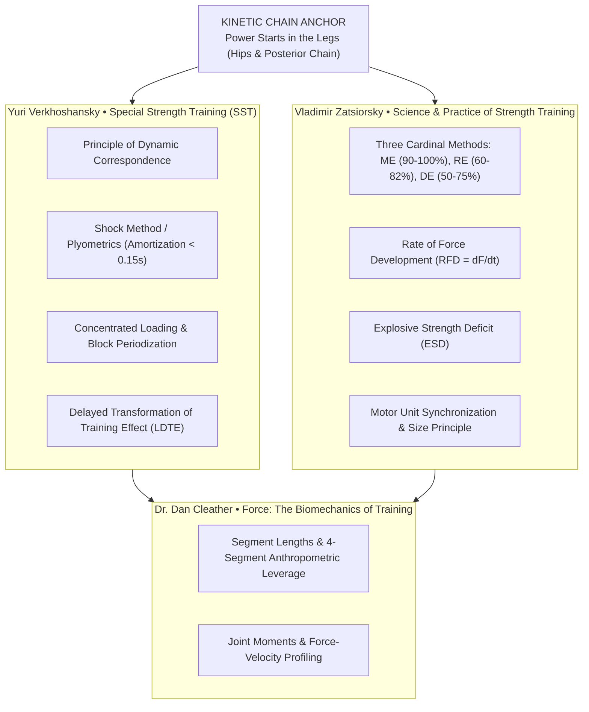
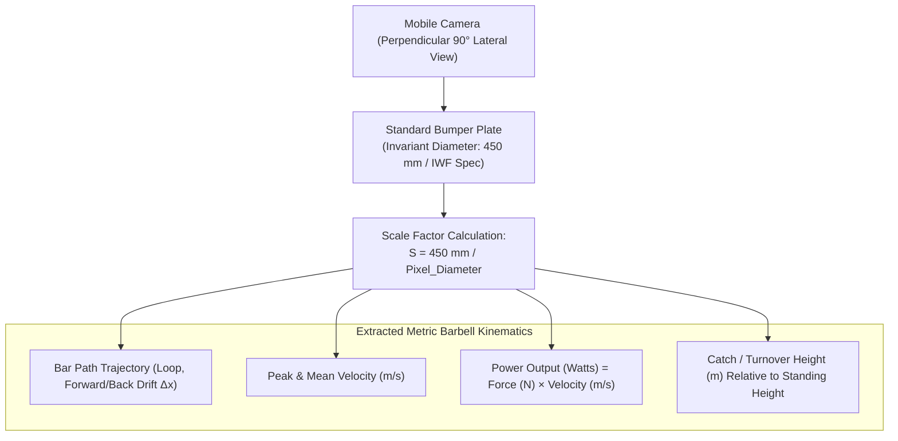
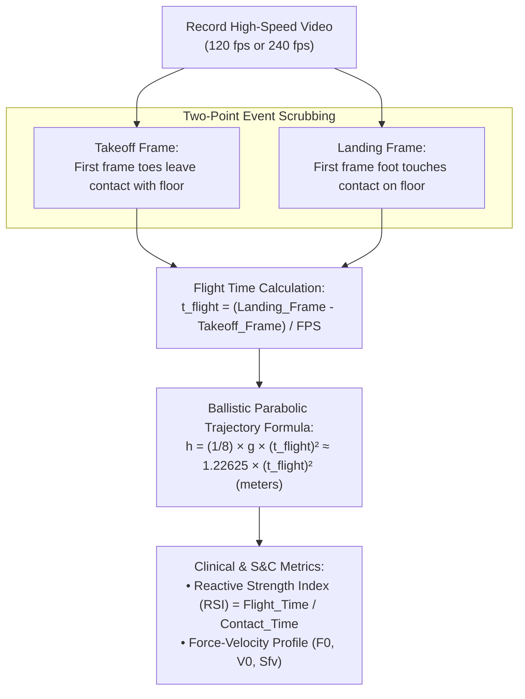

# Small Goods Gym: Sports Science Knowledge Base & Computer Vision VBT Research Dossier

**Author:** Kamilla Gafurzianova, OLY  
**Target Facility:** Small Goods Gym (Morley, Perth, WA), Joel Mullen & Holly Hunt  
**Technical Stakeholders:** Javier (Backend / Cloudflare Infrastructure), Kamilla Gafurzianova, OLY (Sports Tech / AI Architecture)  
**Date:** September 15, 2026  

---

## Executive Overview

During the September 14, 2026 intake consultation, Joel Mullen outlined the foundational requirement for the Small Goods Gym application: **the AI Assistant Coach must not be a generic, unconstrained chatbot**. It must be strictly grounded in empirical, deterministic sports science literature, objective biomechanical physics, and computer-vision-derived movement kinematics.

This dossier establishes:
1. **The Soviet Sports Science Grounding:** Detailed extraction and computational logic from **Yuri Verkhoshansky** and **Vladimir Zatsiorsky**, supplemented by **Dr. Dan Cleather**.
2. **Computer Vision & Kinematic Analysis App Research:** Deep architectural breakdown of **WL Analysis** (barbell tracking via 450mm plate calibration) and the jump-height app Joel described (**My Jump 2 / My Jump Lab** by Dr. Carlos Balsalobre-Fernández), along with competitive landscape analysis.
3. **Synthesis & Strategic Recommendations:** Actionable proposals for client-side automated computer vision, deterministic in-session triage algorithms, and NDIS clinical outcome bridges for physiotherapist Holly Hunt.

---

## 1. Soviet Sports Science Knowledge Base



### A. Yuri Verkhoshansky (Юрий Витальевич Верхошанский)
*Pioneer of Special Strength Training (SST) & Father of Modern Plyometrics*

#### Key Literature
- **Verkhoshansky, Y. V., & Siff, M. C. (2009).** *Supertraining (6th Expanded Edition)*. Verkhoshansky.com.
- **Verkhoshansky, Y. V. (2006).** *Special Strength Training: A Manual for Coaches*. Rome: Verkhoshansky SST.
- **Verkhoshansky, Y. V. (1985).** *Programming and Organization of Training*. Moscow: Fizkultura i Sport.

#### Core Principles Integrated into the AI Coach Engine
1. **The Principle of Dynamic Correspondence (*Динамическое соответствие*):**
   Exercises must match the competitive sporting movement across 5 specific criteria:
   - *Amplitude and direction of movement:* Force must be expressed in the exact spatial vectors of the competitive exercise.
   - *Accentuated region of force production:* Peak force must occur at the critical joint angle/leverage point (e.g., sticking point or transition in the snatch/clean).
   - *Dynamics of effort:* The magnitude of force must match or exceed competition demands.
   - *Rate of Force Development (RFD):* The gradient of force rise ($dF/dt$) must match the explosive demands of the target movement.
   - *Regime of muscular work:* Reversible muscle actions (stretch-shortening cycle, quasi-isometric, or eccentric-concentric coupling).
2. **The Shock Method (*Ударный метод*):**
   - True plyometrics is not jumping up onto boxes; it is the **Shock Method** (depth jumps from a controlled height, typically 0.5m to 0.75m).
   - Uses the kinetic energy of a falling body to stimulate an intense involuntary stretch reflex (myotatic reflex) and storage of elastic potential energy in tendinous structures (titin and collagen).
   - *Amortization Phase Constraint:* The transition from eccentric brake to concentric drive must occur in **$< 0.15$ seconds**. If contact time exceeds $0.20$ seconds, the elastic energy dissipates as heat, rendering the drill ineffective.
3. **Kinetic Chain Primacy ("Power Starts with the Legs"):**
   - Joel specifically highlighted Verkhoshansky's findings: across Olympic weightlifting, track and field throwing (shot put, discus, javelin), and sprinting, the legs and hips produce $> 80\%$ of total work and momentum.
   - The trunk acts as a rigid, non-compliant transmission rod; the upper extremities act as steering cables and accelerative whips.
   - *AI Coaching Cue:* When an athlete struggles with lockouts or terminal bar height, the AI assistant will never cue arm pulling first; it will analyze hip extension impulse and leg drive contact time.
4. **Delayed Transformation of Training Effect (LDTE):**
   - Concentrated blocks of high-volume loading temporarily depress athletic performance (fatigue masking fitness). Peak readiness emerges 2–4 weeks after the volume drop during restitution.

---

### B. Vladimir Zatsiorsky (Владимир Михайлович Зациорский)
*World-Renowned Biomechanist, Former Soviet Sport Institute Director, Penn State Professor*

#### Key Literature
- **Zatsiorsky, V. M., & Kraemer, W. J. (2006).** *Science and Practice of Strength Training (2nd/3rd Ed.)*. Human Kinetics.
- **Zatsiorsky, V. M. (2002).** *Kinetics of Human Motion*. Human Kinetics.
- **Zatsiorsky, V. M. (1998).** *Kinematics of Human Motion*. Human Kinetics.

#### Core Principles Integrated into the AI Coach Engine
1. **The Three Cardinal Methods of Strength Training:**
   | Method | Load (% 1RM) | Reps / Sets | Primary Mechanism | Neural vs. Hypertrophic Adaptation |
   | :--- | :--- | :--- | :--- | :--- |
   | **Maximal Effort (ME)** | 90% – 100% | 1–3 reps, 3–5 sets | Maximal motor unit recruitment + rate coding | Neural: Intramuscular and intermuscular coordination without excess fatigue |
   | **Repeated Effort (RE)** | 60% – 82% | 6–12 reps to failure | Exhausting motor units to stimulate protein synthesis | Structural: Sarcoplasmic & myofibrillar hypertrophy, metabolic stress |
   | **Dynamic Effort (DE)** | 50% – 75% | 1–3 reps @ max accel | Maximizing Rate of Force Development ($dF/dt$) | Neural: Explosive rate coding, fast-twitch (Type IIx) synchronization |

2. **Rate of Force Development (RFD) & Explosive Strength Deficit (ESD):**
   - In sporting movements, available time to produce force is often only $100 - 300\text{ ms}$, whereas maximal static force generation requires $400 - 600\text{ ms}$.
   - $ESD = \frac{F_{max} - F_{explosive}}{F_{max}} \times 100\%$.
   - A lifter with a large ESD needs Dynamic Effort / ballistic work; a lifter with low absolute force needs Maximal Effort work.
3. **The Size Principle & Motor Unit Rate Coding:**
   - Henneman's Size Principle dictates that motor units are recruited in order of increasing size (Type I slow-twitch $\to$ Type IIa $\to$ Type IIx fast-twitch).
   - In high-velocity ballistic movements (or loads $>85\%$), the threshold of recruitment drops dramatically, allowing instantaneous synchronization of high-threshold motor units.

---

### C. Dr. Dan Cleather
*Professor of Biomechanics, St Mary's University London*

#### Key Literature
- **Cleather, D. J. (2021).** *Force: The Biomechanics of Training*.
- **Cleather, D. J. (2018).** *The Little Black Book of Training Wisdom*.

#### Core Principles Integrated into the AI Coach Engine
- **Torque and Moment Arms:** Joint moments ($\tau = F \times d_{\perp}$) dictate muscular demand. Lifters with long femurs relative to torso length experience longer external moment arms at the hip in the squat, shifting mechanical bias to the posterior chain.
- **Force Vector Specificity:** Vertical vs. horizontal force expression and the folly of over-complicating movement when consistency and mechanical leverage dominate.

---

## 2. Deep Dive: Computer Vision & Kinematics Apps

### A. WL Analysis (Weightlifting Analysis)
*The Barbell Kinematics & Trajectory Engine*



#### How It Works
1. **Calibration Scale via Bumper Plate:**
   Standard International Weightlifting Federation (IWF) bumper plates have an exact, invariant outer diameter of **$450\text{ mm}$ ($0.45\text{ m}$)**.
   The user records from a 90-degree lateral viewpoint. The app identifies the circular boundary of the outer plate. By computing:
   $$\text{Scale Factor } (S) = \frac{450\text{ mm}}{\text{Diameter in Pixels}} \quad (\text{mm/pixel})$$
   every subsequent pixel displacement $(\Delta x, \Delta y)$ is converted into precise metric coordinates $(\text{meters})$.
2. **Key Metric Extractions:**
   - **Horizontal Loop / Drift ($\Delta x$):** Measures forward or backward bar swing. A forward loop $> 5\text{ cm}$ in the 2nd pull indicates excessive hip thrust rather than vertical leg drive.
   - **Peak Velocity ($V_{max}$) & Mean Velocity ($V_{mean}$):** Snatch typically requires $V_{max} \ge 1.6 - 2.0\text{ m/s}$; Clean requires $V_{max} \ge 1.2 - 1.4\text{ m/s}$.
   - **Turnover Height:** Bar height relative to lifter's standing height determines whether the athlete caught the bar in a power position or full squat.

#### Market Alternatives & Comparative Matrix
| App / Tool | Tech Stack / Sensors | Calibration Method | Real-Time vs. Post-Hoc | Hardware Required |
| :--- | :--- | :--- | :--- | :--- |
| **WL Analysis** | Mobile Video Computer Vision | 450mm Bumper Plate circle | Post-session analysis | None (Phone camera) |
| **Metric VBT** | On-device ML (iOS Vision / CoreML) | Markerless auto-detection | Real-time audio cues | None (iOS only) |
| **Iron Path / BarSense** | Video color-tracking | Manual line calibration | Post-session trace | None |
| **Enode (formerly Vmaxpro)** | Optical IMU (accelerometer + gyro) | Direct inertial measurement | Instant Bluetooth stream | Hardware puck ($399+) |
| **GymAware / Vitruve** | Linear Position Transducer (tether) | Direct linear optical encoder | Gold-standard live feedback | Hardware unit ($400 - $2,500) |

---

### B. The Jump App: "My Jump 2" / "My Jump Lab"
*Creator: Dr. Carlos Balsalobre-Fernández (Ph.D. Sports Science)*



#### The Scientific Validation Behind the App
Joel accurately described the exact UX of **My Jump 2** (now consolidated into **My Jump Lab**):
1. **High-Speed Frame Capture:** The user shoots slow-motion video at **240 fps** (or 120 fps). At 240 fps, the temporal resolution is $\frac{1}{240} \approx 0.00416\text{ seconds}$ ($4.17\text{ ms}$ per frame).
2. **Two-Point Frame Scrubbing:**
   - **Takeoff Frame:** The exact frame where the athlete's toes lose contact with the floor.
   - **Landing Frame:** The exact frame where the athlete makes initial ground contact (without pre-dorsiflexing or tucking knees).
3. **The Flight-Time Jump Height Formula:**
   Because a projectile under uniform gravitational acceleration ($g = 9.81\text{ m/s}^2$) spends equal time ascending and descending:
   $$t_{rise} = \frac{t_{flight}}{2}$$
   $$h = \frac{1}{2} g t_{rise}^2 = \frac{1}{2} g \left(\frac{t_{flight}}{2}\right)^2 = \frac{1}{8} g t_{flight}^2 \approx 1.22625 \cdot t_{flight}^2$$
4. **Peer-Reviewed Scientific Reliability:**
   - Validated across $> 15$ clinical sports science studies (Balsalobre-Fernández et al., *Journal of Sports Sciences*, 2015).
   - Shows near-perfect agreement ($r = 0.995$, ICC $= 0.997$) with **Kistler Force Plates** ($1000\text{ Hz}$) and **Optojump optical bars**.
5. **Advanced Derived Metrics Available in My Jump:**
   - **Reactive Strength Index (RSI):** In Drop Jumps: $RSI = \frac{\text{Flight Time (s)}}{\text{Contact Time (s)}}$.
   - **Force-Velocity Profiling ($F-V$ Profile):** Jumping with progressive loads (e.g., $0\text{kg}, 20\text{kg}, 40\text{kg}, 60\text{kg}$) to compute maximum theoretical force ($F_0$), maximum theoretical velocity ($V_0$), and optimal profile slope ($S_{fv}$).

#### Jump App Ecosystem & Alternatives
| App / System | Principle of Measurement | Clinical Validation | Cost | Best Use Case |
| :--- | :--- | :--- | :--- | :--- |
| **My Jump Lab (My Jump 2)** | High-speed video frame delta (flight time) | Gold-standard peer-reviewed | ~$15 one-time | Team/gym floor testing without hardware |
| **What's My Jump / Jumpster** | Video flight time | Moderate | Free / Freemium | Quick informal checks |
| **Output Sports** | Wearable IMU + camera fusion | Peer-reviewed | Subscription ($$) | Multi-test battery (sprint, jump, VBT) |
| **Hawkin Dynamics / VALD ForceDecks** | Dual dual-axis force plates ($1000\text{Hz}$) | Elite laboratory standard | $5,000 - $15,000 | Deep eccentric/concentric impulse analysis |

---

## 3. What Else Could We Do? High-Leverage Proposals for Small Goods

### Proposal 1: Automated Client-Side WebAssembly Computer Vision (Zero Hardware)
Instead of forcing lifters to manually scrub video frames or buy $400 hardware pucks:
- **Barbell Plate Detection:** Use OpenCV.js / MediaPipe in WebAssembly running locally inside the browser. It automatically detects the circular contour of the standard 450mm plate, runs an optical tracker on the bar collar, and generates a live bar-path trajectory line and velocity estimate ($m/s$) immediately upon video upload.
- **Automated Jump Flight-Time:** Train a micro-model or use optical flow on the bottom 15% of the video frame (the foot-ground interaction zone). The moment pixel velocity drops to zero marks landing; the moment vertical velocity spikes from zero marks takeoff.

### Proposal 2: Deterministic In-Session Triage Algorithm ("The 90-Second Co-Pilot")
Joel highlighted the problem of an athlete failing two consecutive snatches at prescribed weight. The AI Assistant Coach will execute a deterministic decision tree rather than LLM guesswork:

```mermaid
flowchart TD
    Fail["Athlete Fails 2 Consecutive Working Sets"]
    Eval["Evaluate Bar Velocity Drop (Δv) via Enode BLE / Telemetry"]
    
    subgraph PositionalFault["Mechanical / Positional Fault (Δv < 10%)"]
        CheckBio["Check 4-Segment Anthropometric Profile"]
        HighTorso["High Torso / Femur Ratio:<br/>Cue: 'Hold chest tall over bar'"]
        LongFemurs["Long Femurs / Short Torso:<br/>Cue: 'Push knees out, drive floor'"]
        ArmLever["Long Forearm / Short Humerus:<br/>Adjust grip width & bar contact point"]
    end

    subgraph CNSFatigue["Systemic / CNS Fatigue (Δv > 15%)"]
        LoadCut["Prescribe Immediate Load Cut:<br/>Drop load by 5% – 7.5% immediately"]
        SetCheck{"Next Set Successful?"}
        CompleteSet["Complete Prescribed Reps at Adjusted Velocity"]
        TerminateLift["Terminate Primary Lift:<br/>Transition to Hypertrophy / Accessory Work"]
    end

    Fail --> Eval
    Eval -->|Δv < 10% (Speed Normal)| CheckBio
    CheckBio --> HighTorso
    CheckBio --> LongFemurs
    CheckBio --> ArmLever

    Eval -->|Δv > 15% (Severe Velocity Decay)| LoadCut
    LoadCut --> SetCheck
    SetCheck -->|Yes| CompleteSet
    SetCheck -->|No| TerminateLift
```

### Proposal 3: NDIS Clinical Outcome Bridge for Holly Hunt (Physiotherapy)
Connect the jump RSI and barbell VBT metrics directly to NDIA-approved functional reporting:
- **Fall Prevention & Reactive Balance:** Track Drop Jump contact times ($< 250\text{ ms}$) and RSI as clinical evidence of tendon compliance and neurological protective reflexes for NDIS participants.
- **Asymmetry Detection:** Use bilateral video tracking to flag unweighted limb favor ($> 10\%$ lateral shift) during the concentric phase, routing a warning directly to Holly's triage queue.

### Proposal 4: The Javier Integration Contract (Cloudflare Worker & D1 Spec)
A lean, zero-overhead JSON schema that Javier can integrate into his existing Cloudflare Workers/D1 backend without refactoring his auth tables:
- Direct edge routing via `worker-chat-proxy.ts` with Clerk JWT authentication.
- Telemetry logging into Cloudflare D1 (SQLite) with isolated PII (`users` vs. `workout_sets`).
- Full client support for React Native (Expo) on gym iPads and lifter iPhones.

---

*Verified and Prepared for Integration into Small Goods Gym Engine & Knowledge Base.*
