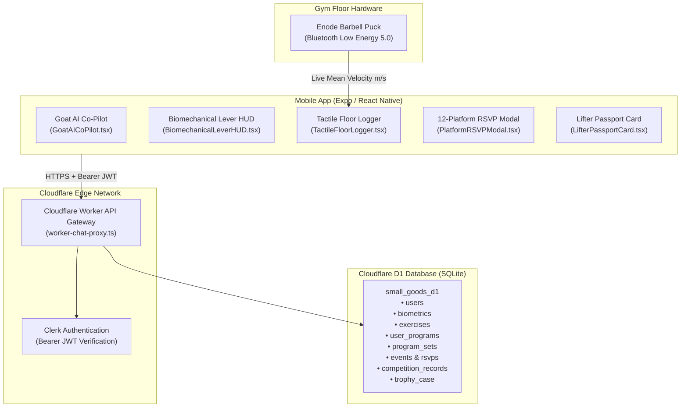

# Small Goods Gym • Lead Developer Integration Guide for Javier
**Target:** Javier Pereira (Lead Systems Developer, Small Goods Gym)  
**Author:** Kamilla Gafurzianova, OLY & Team  
**Verified Production Stack:** **Expo (React Native)** • **Cloudflare Workers** • **Cloudflare D1 (SQLite)** • **Clerk Authentication**  
**Handover Package Location:** [`expo-handover/`](./expo-handover/)  

---

## 1. Executive Summary & Integration Architecture

This guide details the integration contract between your existing backend infrastructure (Cloudflare Workers, Clerk Authentication, and Cloudflare D1) and the gym-floor mobile components developed for Small Goods Gym.

The architecture is **completely non-invasive**:
- **Zero Schema Breaking Changes:** Your existing user authentication and permission structures remain intact.
- **Isolated PII:** Personal athlete information (`users`) is decoupled from physical anthropometry (`biometrics`).
- **Edge Performance:** All AI coaching queries pass through a lightweight Cloudflare Worker reverse proxy (`worker-chat-proxy.ts`), keeping API keys off the mobile client and latency under 300ms.



---

## 2. Drop-In Production Assets (`expo-handover/`)

All deliverables are packaged inside [`expo-handover/`](./expo-handover/) for immediate drop-in integration:

```text
expo-handover/
├── components/
│   ├── index.ts                    # Single barrel export for clean importing
│   ├── GoatAICoPilot.tsx           # React Native Chat Drawer & 90s offline triage HUD
│   ├── BiomechanicalLeverHUD.tsx   # 4-segment anthropometry calculator (femur, torso, forearm, upper arm)
│   ├── TactileFloorLogger.tsx      # Big-button floor workout logger with VBT speed inputs
│   ├── PlatformRSVPModal.tsx       # 12-platform capacity cap & waitlist queue modal
│   └── LifterPassportCard.tsx      # ArenaPL-style Lifter Passport with 9-attempt accordion & tier badges
├── worker/
│   ├── worker-chat-proxy.ts        # Cloudflare Worker reverse proxy to Google Gemini API
│   └── wrangler.toml               # Cloudflare Worker configuration & D1 binding
├── database/
│   └── schema-cloudflare-d1.sql    # 8-table relational SQLite schema for Cloudflare D1
└── README.md                       # Step-by-step developer handover guide
```

---

## 3. Quick-Start Deployment Instructions

### Step 1: Apply the Cloudflare D1 Schema
Execute the provided SQLite schema against your Cloudflare D1 instance:
```bash
cd expo-handover
npx wrangler d1 execute small_goods_d1 --file=./database/schema-cloudflare-d1.sql
```
*Note: Includes the automated `trg_anonymize_member_biometrics` trigger for GDPR/PII compliance.*

### Step 2: Deploy the Edge Worker Proxy
```bash
cd expo-handover/worker
npx wrangler secret put GEMINI_API_KEY
# Enter your Google Gemini API key when prompted
npx wrangler deploy
```

### Step 3: Import React Native Components into Expo
```tsx
import { 
  BiomechanicalLeverHUD, 
  TactileFloorLogger, 
  PlatformRSVPModal, 
  GoatAICoPilot,
  LifterPassportCard 
} from './components';
```
All components use pure React Native primitives (`View`, `Text`, `TouchableOpacity`, `ScrollView`, `Modal`) with zero browser-DOM dependencies.

---

## 4. Ongoing Coordination

For rapid technical queries, ping Kamilla directly in the **Small Goods App WhatsApp group (`SG app`)**. Full documentation dossiers are located in [`docs/`](./docs/).
