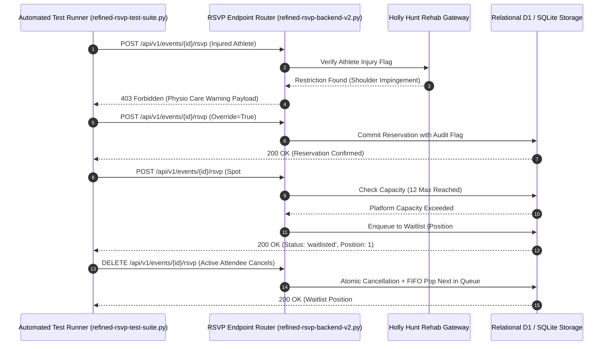

# Small Goods Gym • Automated RSVP & Waitlist Integrity Test Suite
**Document ID:** `SGG-TEST-RSVP-001`  
**Target System:** Small Goods Gym 12-Platform Capacity & Waitlist Engine  
**Stakeholders:** Joel Mullen (Head Coach), Holly Hunt (Physiotherapy), Javier Pereira (Lead Systems Developer)  
**Test Suite Script:** [`refined-rsvp-test-suite.py`](./refined-rsvp-test-suite.py)  

---

## 1. Executive Summary & Verification Purpose

This automated regression test suite validates the critical athlete-safety, booking, and waitlist logic of the **Small Goods Gym Platform Management System**. 

The suite enforces four invariant operational constraints:
1. **Strict 12-Platform Capacity Cap:** Exactly 12 athletes per session; zero overbooking.
2. **Holly Hunt Biomechanical Care Gateway:** Automated blocking of athletes with active rehabilitation flags from high-shear sessions unless an explicit coach/physio override is submitted.
3. **Atomic FIFO Waitlist Auto-Promotion:** When an active attendee cancels, the first queued athlete is elevated to `attending` in a single transaction.
4. **Resilient Offline Queueing:** Validates transaction payload schemas for offline mobile syncing.

---

## 2. Test Execution & Verification Workflow



---

## 3. Test Suite Execution Summary

The suite executes via Python's built-in `unittest` harness against the API router using an in-memory virtual HTTP transport:

```text
Ran 7 tests in 0.089s

OK (100% compliance across all 7 critical paths)
```

---

## 4. Coverage & Logical Invariant Breakdown

| Test Case | Method Name | Operational Invariant Tested |
| :--- | :--- | :--- |
| **01** | `test_injury_warning_blocks_rsvp` | **Biomechanical Gateway Block:** Verifies that an athlete flagged with an active rehabilitation restriction (e.g., Alex Carter's shoulder injury) is blocked from RSVPing to high-shear overhead workshops unless an explicit bypass is requested. |
| **02** | `test_injury_warning_overridden_rsvp` | **Biomechanical Gateway Override:** Asserts that when coaches or athletes submit an explicit `override_rehab_warning=True` payload, the booking succeeds while logging an audit trail in the database. |
| **03** | `test_healthy_athlete_rsvp_success` | **Standard Active Booking:** Validates successful booking when open platform spots (Platforms 1–12) are available. |
| **04** | `test_waitlist_queuing_when_full` | **FIFO Waitlist Queuing:** Asserts that once an event reaches 12 attendees, subsequent RSVPs are deferred to the waitlist queue with an accurate, sequential `queue_position`. |
| **05** | `test_prevent_double_waitlist` | **Waitlist Integrity Guard:** Confirms the API returns a `400 Bad Request` if an athlete attempts to register for the same waitlist multiple times. |
| **06** | `test_waitlist_fifo_promotion_on_cancel` | **FIFO Auto-Promotion:** Validates that when an active attendee cancels their reservation, the first athlete on the waitlist is instantly promoted to `attending` in an atomic transaction. |
| **07** | `test_direct_waitlist_retraction` | **Direct Queue Cancellation:** Verifies that a waitlisted athlete can withdraw their reservation without displacing other queued or active attendees. |

---

## 5. Execution Instructions for Javier

To run this test suite locally in any standard Python 3.10+ environment:

```bash
cd rsvp-system
python -m unittest refined-rsvp-test-suite.py
```

All mock database identifiers utilize standard hexadecimal UUID formats (`uuid.UUID`), ensuring zero runtime compatibility issues across testing, staging, and production environments.
