# Small Goods Gym - Stitch Design System Export

**Project Title:** Small Goods Design System  
**Project ID:** `6480908177671535164`  
**Export Date:** 2026-09-14T19:42:38.982Z  
**Total Screens & Assets:** 14  

---

## Exported Assets & Screens

### 01. small-goods-logo_sticker@2x-p-500.png
- **ID:** `13679795955483654000`
- **Type:** image
- **Screenshot/Image:** [`01_small_goods_logo_sticker2x_p_500.png`](./01_small_goods_logo_sticker2x_p_500.png)

---

### 02. DESIGN.md
- **ID:** `13916102788059528318`
- **Type:** markdown
- **Code File:** [`02_designmd.md`](./02_designmd.md)

---

### 03. Design System
- **ID:** `assets_e2e426d0d8c54d31821912ffa6385517`
- **Type:** Design System Definition
- **Code File:** [`03_design_system.md`](./03_design_system.md)

---

### 04. Small Goods Gym - Interactive Web Application
- **ID:** `24afc3761bcd4a6caeacd4f8220bea1f`
- **Type:** screen
- **Code File:** [`04_small_goods_gym_interactive_web_application.html`](./04_small_goods_gym_interactive_web_application.html)
- **Screenshot/Image:** [`04_small_goods_gym_interactive_web_application.png`](./04_small_goods_gym_interactive_web_application.png)

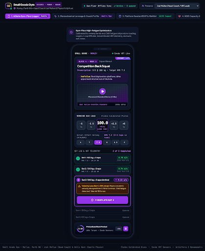

---

### 05. Small Goods Mobile PWA - Tactile Industrial HUD
- **ID:** `a2609c0acbdc4ae99e47b08b1abd8cce`
- **Type:** screen
- **Code File:** [`05_small_goods_mobile_pwa_tactile_industrial_hud.html`](./05_small_goods_mobile_pwa_tactile_industrial_hud.html)
- **Screenshot/Image:** [`05_small_goods_mobile_pwa_tactile_industrial_hud.png`](./05_small_goods_mobile_pwa_tactile_industrial_hud.png)

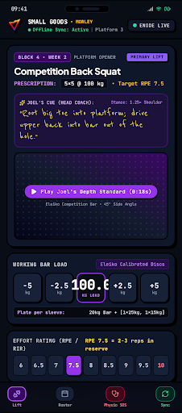

---

### 06. Small Goods Mobile PWA - Sports-Science Lab Flow
- **ID:** `239b75b902cc4a84ae276ab49b9ff434`
- **Type:** screen
- **Code File:** [`06_small_goods_mobile_pwa_sports_science_lab_flow.html`](./06_small_goods_mobile_pwa_sports_science_lab_flow.html)
- **Screenshot/Image:** [`06_small_goods_mobile_pwa_sports_science_lab_flow.png`](./06_small_goods_mobile_pwa_sports_science_lab_flow.png)

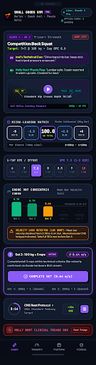

---

### 07. Small Goods Mobile PWA - Kinetic Ergonomic HUD
- **ID:** `8bc11d2f24be4c348b6dec6e73eb7b69`
- **Type:** screen
- **Code File:** [`07_small_goods_mobile_pwa_kinetic_ergonomic_hud.html`](./07_small_goods_mobile_pwa_kinetic_ergonomic_hud.html)
- **Screenshot/Image:** [`07_small_goods_mobile_pwa_kinetic_ergonomic_hud.png`](./07_small_goods_mobile_pwa_kinetic_ergonomic_hud.png)

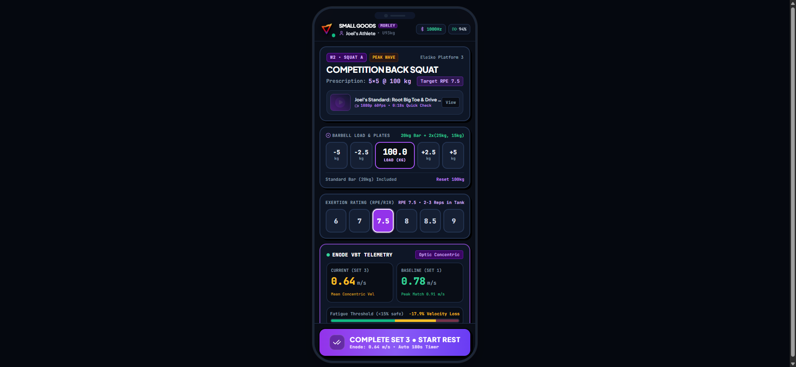

---

### 08. Tactile Anthropometry Terminal & Kinematic HUD
- **ID:** `8ce84d508ce4462ea9d9c4406feb6130`
- **Type:** screen
- **Code File:** [`08_tactile_anthropometry_terminal_kinematic_hud.html`](./08_tactile_anthropometry_terminal_kinematic_hud.html)
- **Screenshot/Image:** [`08_tactile_anthropometry_terminal_kinematic_hud.png`](./08_tactile_anthropometry_terminal_kinematic_hud.png)

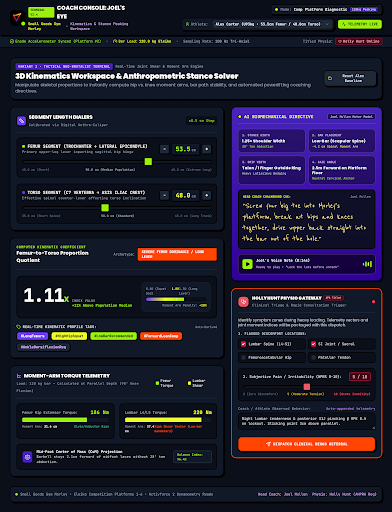

---

### 09. Sports Science Anthropometry & Lever Matrix
- **ID:** `bc5e24ea96464774b9c1ddcf1330053f`
- **Type:** screen
- **Code File:** [`09_sports_science_anthropometry_lever_matrix.html`](./09_sports_science_anthropometry_lever_matrix.html)
- **Screenshot/Image:** [`09_sports_science_anthropometry_lever_matrix.png`](./09_sports_science_anthropometry_lever_matrix.png)

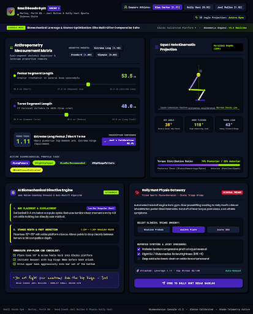

---

### 10. Small Goods Gym - Accessible Neo-Brutalist Light Mode
- **ID:** `4efec6d9b35540949ca18efeae6facb7`
- **Type:** screen
- **Code File:** [`10_small_goods_gym_accessible_neo_brutalist_light_mode.html`](./10_small_goods_gym_accessible_neo_brutalist_light_mode.html)
- **Screenshot/Image:** [`10_small_goods_gym_accessible_neo_brutalist_light_mode.png`](./10_small_goods_gym_accessible_neo_brutalist_light_mode.png)

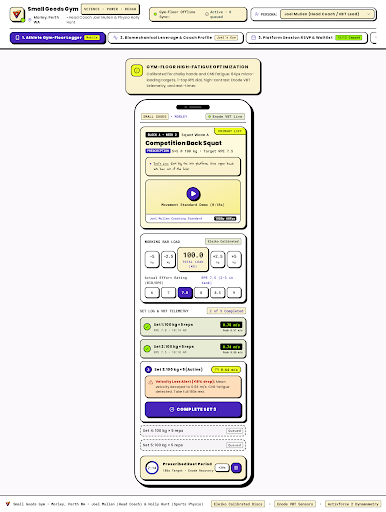

---

### 11. Biomechanical Leverage Diagnostic HUD - Sports Science Lab
- **ID:** `ff01a6bb37ec4c55b4f90d2838be06d9`
- **Type:** screen
- **Code File:** [`11_biomechanical_leverage_diagnostic_hud_sports_science_lab.html`](./11_biomechanical_leverage_diagnostic_hud_sports_science_lab.html)
- **Screenshot/Image:** [`11_biomechanical_leverage_diagnostic_hud_sports_science_lab.png`](./11_biomechanical_leverage_diagnostic_hud_sports_science_lab.png)

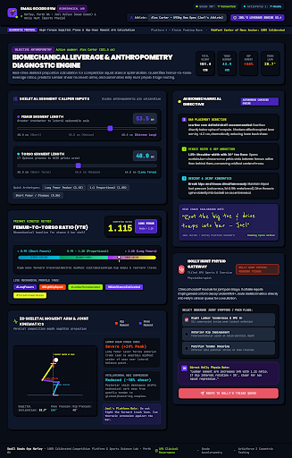

---

### 12. Accessible Neo-Brutalist NDIS Clinical Portal & Plan Manager Hub
- **ID:** `10dbe385730b474a9e3ae1bf3c0d8887`
- **Type:** screen
- **Code File:** [`12_accessible_neo_brutalist_ndis_clinical_portal_plan_manager_hub.html`](./12_accessible_neo_brutalist_ndis_clinical_portal_plan_manager_hub.html)
- **Screenshot/Image:** [`12_accessible_neo_brutalist_ndis_clinical_portal_plan_manager_hub.png`](./12_accessible_neo_brutalist_ndis_clinical_portal_plan_manager_hub.png)

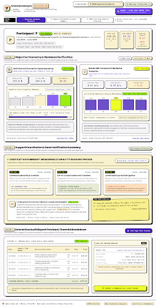

---

### 13. Small Goods NDIS Hub - Clinical Audit & Telemetry Suite
- **ID:** `726871122e2b46bc8b896672a69afde6`
- **Type:** screen
- **Code File:** [`13_small_goods_ndis_hub_clinical_audit_telemetry_suite.html`](./13_small_goods_ndis_hub_clinical_audit_telemetry_suite.html)
- **Screenshot/Image:** [`13_small_goods_ndis_hub_clinical_audit_telemetry_suite.png`](./13_small_goods_ndis_hub_clinical_audit_telemetry_suite.png)

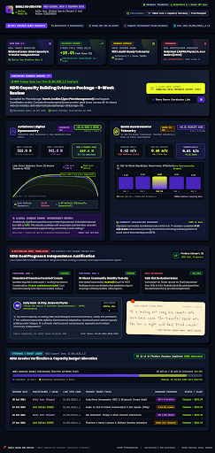

---

### 14. NDIS Evidence Engine - Objective Hardware Biometrics HUD
- **ID:** `8394399ae28d4b5ab1e5a681264b7ad6`
- **Type:** screen
- **Code File:** [`14_ndis_evidence_engine_objective_hardware_biometrics_hud.html`](./14_ndis_evidence_engine_objective_hardware_biometrics_hud.html)
- **Screenshot/Image:** [`14_ndis_evidence_engine_objective_hardware_biometrics_hud.png`](./14_ndis_evidence_engine_objective_hardware_biometrics_hud.png)

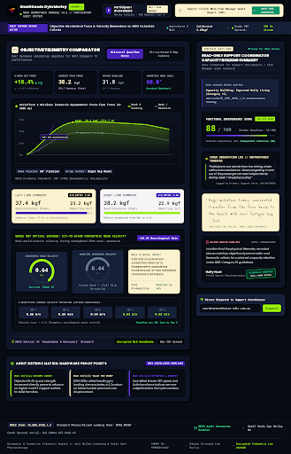

---

